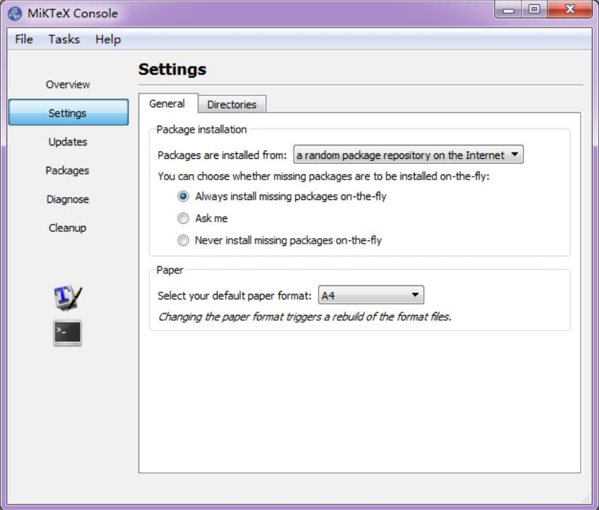

# FAQ in IE6600

The following are the solutions/answers covered most of the questions in the class:

## R Markdown Issues
### 1. Error(s) with installation of tinytex/MikTex

> **If you have to use MikTex:**

You can install the dev version of the R package tinytex:

```r
devtools::install_github('yihui/tinytex')
```

If you haven't installed MiKTeX, remember to check the option Yes in Install missing packages when installing it:

<p align="center">
  
</p>

If you have already installed MiKTeX, go to the Start menu, find the menu "MiKTeX Console", and choose the option Always install missing packages on-the-fly:

<p align="center">
  
</p>

> **If you don’t have to use MiKTeX:**


Things will be a little easier. Uninstall MiKTeX if you have installed it (or temporarily rename its installation folder if you don't want to get rid of it completely), then in R:

```r
install.packages('tinytex')
tinytex::install_tinytex()
```

This will install TinyTeX (a custom version of TeX Live), which can also build LaTeX documents to PDF on Windows (more info, see <https://yihui.name/tinytex/>). Restart RStudio/R when the installation is done (it may take 3-5 minutes).

Reference: @Yihui, <https://github.com/rstudio/rmarkdown/issues/1285#issuecomment-374340175>


### 2. If above doesn't work

If you still have issues with LaTex/tinytex, please download the following tools directly:

- For Mac user: MacTex 2022 - <http://tug.org/mactex/>
- For Win user: MiKTeX - <https://miktex.org/download>


### 3. If you have the pandoc error 137

```
Error: pandoc document conversion failed with error 137
```

You may have two alternative ways to deal with it (Recommended the first one):
-	Knit your .rmd to .html and then print/save it as .pdf.
-	Please check the post: <https://stackoverflow.com/questions/51410248/r-markdown-to-html-via-knitr-pandoc-error-137?rq=1>

***

## R Language
### 1.	Error in loading packages in Rstudio (See figure)

<p aligh="center">
  
</p>

You have successfully loaded the ggplot2. The issue is on the package of colorspace.

Please do the following:

```r
remove.packages(c("ggplot2", "colorspace"))
install.packages('ggplot2', dependencies = TRUE)
install.packages('colorspace', dependencies = TRUE)
```


### 2.	When I use the is.character(x) or is.numeric(x) to judge the vector x, it doesn't show all result of elements.
When you assign variables into one vector, then all the elements in the vector will be treated as the same data type. But if you want to check each of the elements' data type, You may want to use the following function: `sapply()` or `lapply()`


```r
temp<-c(1,2,"a")
sapply(temp, is.character)
```

### 3.	What is coercion rule in R?
R follows the coercion rule, which means if a vector contains multiple data types it will convert a logical to a number and number to a character.

### 4.	I can't understand the data type of factor possesses usage in R language. Could you give me some examples?
Try the following in R:

```r
ggplot(mpg)+geom_bar(aes(drv))
ggplot(mpg)+geom_bar(aes(factor(drv, levels=c("r",4, "f"))))
```

### 5.	Changing size/color by using size=0.1 or color="blue" but this kind of coding will make every point the same,
When syntax size= and color= are inside of aes()which allows you to assign variables to different sizes or colors. When they are outside of aes(), which allows you to assign constant values to size or color, 1, or "blue", etc.
 
## R with Tableau
1.	How to connect R to Tableau?
please check out the following tutorial on Youtube: <https://www.youtube.com/watch?v=iReaNA4D2os&list=PLkqc8xRb_lIDSWEEtX9wJsngZyMPb6np3&index=7>
