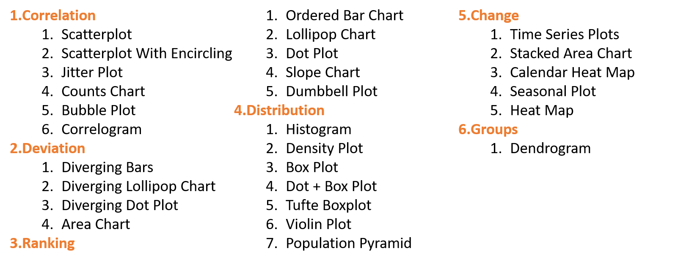

# Exploratory Data Analysis and More Data Visualization

  

## Materials

EDA and Advanced Visualization [[slides/code](https://zhenyuanlu.com/slides/t11AppDataViz.pdf)]

## EDA Topics

  

## Advanced Visualization Topics

- Visualization by PCA
- Spatial Visualization
- Network Visualization
- Animated Visualization
- Interactive Visualization
- Polishing Procedure
