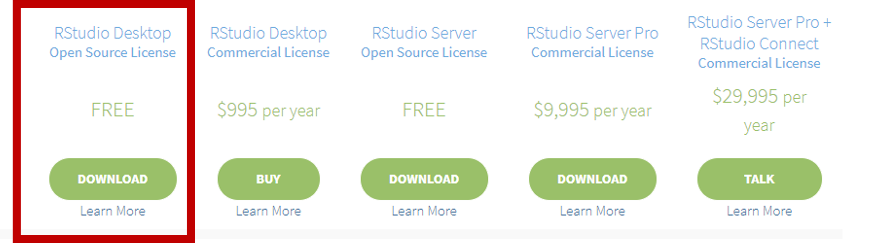
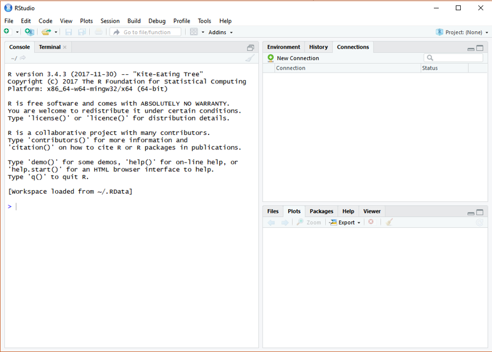
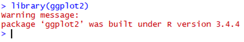
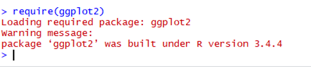
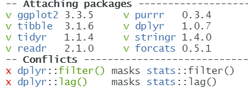

# Basic of R


<p align="center">
  
  
  <!--  -->
</p>

## Installation of R

After you click the following link: <https://cran.r-project.org/>

You will see as the following figure. Click the proper link and start the installation

<p align="center">
  
</p>

**For Mac User:**
Make sure you are downloading the correct version, otherwise it will cause errors

## Installation of R studio
After you click the following link: <https://www.rstudio.com/products/rstudio/download/>

You will see as the following figure. Choose the free version, which is totally enough for our class application and practice

<p align="center">
  
</p>


> ### Tip: Update R language in Rstudio
>
> **For Windows users only:**
>
> ```r
> # install package installr ----
> install.pacages("installr")
> # load package ----
> library(installr)
> # update R ----
> updateR()
> ```
>
> **For Mac users:**
>
> Go to [R project](https://cloud.r-project.org/bin/macosx/) to download the latest R.
>
> *Note: make sure to install the correct version of R for your Mac chips.*


## RStudio Interface

If you have successfully installed the R studio, you will see the same R studio console as the below figure showing after launching on the RStudio. (OS: Windows 10)

In this class, all the practice, homework, and project will be processing on RStudio.


<p align="center">
  
</p>

## R Packages

A package is essentially a library of prewritten code designed to accomplish some task or a collection of tasks. It is the most powerful tool in the R.

In this class we will be more focused on the package of ggplot2, which is most efficient package for visualization. Though there are still some very robust and well-maintained packages out there, such as dplyr, readr, caret, tibbles, or knitr.

### Installation of R Packages

The fastest way to do is typing the following scripts in the Rstudio.

```r
# install package ggplot2 (package name should be a string)
install.packages("ggplot2")
```
*NOTE: the package name is **case sensitive**, which means `Ggplot2` is different from `ggplot2`*

### Get Help Document

There are 3 ways to get help document.
- Press F1 (for laptop may click `Fn+F1`, or "Other function key"+`F1`) and then the help tab will pop up on the right bottom of the RStudio.

- Type `help(install.packages)`

- Type `?install.packages`

Then you will see:

<p align="center">
  
</p>

### Un/Loading R Packages

#### Loading R packages (Two ways)

```r
library(ggplot2)
```
<p align="left">
  
</p>

Or:

```r
require(ggplot2)
```
<p align="left">
  
</p>

`require` is designed for use inside functions returning FALSE/TRUE.

#### Unloading R packages:
```r
detach("package:ggplot2")
```

*NOTE 1: We usually ignore the warning message, not all the time.*\
*NOTE 2: You may need to load the packages again if you relaunch RStudio.*\
*NOTE 3: It will automatedly detach all the global packages you loaded after closing Rstudio,*

*then follow NOTE2...*

<p align="left">
  
</p>


### Packages Needed

You’ll also need to install some R packages. An R package is a collection of
functions, data, and documentation that extends the capabilities of base R.

```r
install.packages("tidyverse")

library(tidyverse)
```

<p align="center">
  
</p>

This tells you that tidyverse is loading the `ggplot2`, `tibble`, `tidyr`, `readr`,
`purrr`, `stringr`, `forcats`, and `dplyr` packages. These are considered to be the core of the tidyverse
because you’ll use them in almost every analysis.

This also tells you that there are two functions from dplyr having conflicts with stats.
You'll use `dplyr::` or `stats::` to specific the function from dplyr.
This is a very common issue students may have.

## Installation of R Markdown

There are many other excellent packages that are not part of the tidyverse.

```r
# install r markdown from CRAN ----
install.packages("rmarkdown")
# or if you want to test the development version ----
# install from GitHub ----
if (!requireNamespace("devtools"))
  install.packages('devtools')
devtools::install_github('rstudio/rmarkdown')
```

If you want to generate PDF output, you will need to install LaTeX. For R Markdown users who have not installed LaTeX before, we recommend that you install tinyteX.

```r
# install tinyteX ----
install.packages("tinytex")

tinytex::install_tinytex()
```

If you have any issues with R Markdown, feel free to check: [FAQ for the class](./faq.md)


#### References:

[1] [Hadley Wickham, Garrett Grolemund. R For Data Science.](https://r4ds.had.co.nz/) \
[2] [Yihui Xie, J. J. Allaire, Garrett Grolemund. R Markdown.](https://bookdown.org/yihui/rmarkdown/)
