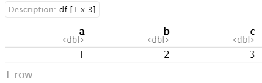
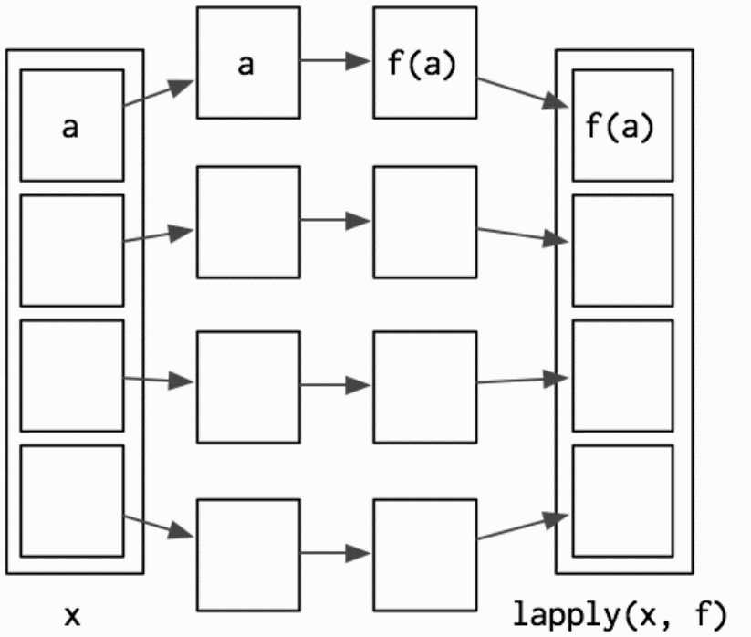

# R Functions

## Functions

R has a large collection of built-in functions that are called like this:

```r
function_name(arg1 = val1, arg2 = val2, ...)
```

Let’s try using sum(), which makes regular summary of numbers. Type su and hit Tab. A pop-up shows you possible completions. Specify sum() by typing more (a “m”) to disambiguate, or by using ↑/↓ arrows to select.

```r
sum(1,2)
```

```text
## [1] 3
```

## How to create function

The default syntax for creating a function as follow:

```r
variable <- function(arg1, arg2,...){
  your expression/algorithm
}
```

## Hello, World!

Now is the very cliché stuff...

If we did not include a "Hello, World!" this would not be a serious and **sleepy** programming class.

```r
hello <- function(){
  print("Hello, World!")
}
hello()
```

```text
## [1] "Hello, World!"
```

## Name masking

You should have no problem predicting the output.

```r
f <- function() {
  x <- 1
  y <- 2
  c(x, y)
}
f()
```

```text
## [1] 1 2
```


If a name isn’t defined inside a function, R will look one level up.

```r
x <- 2
g <- function() {
  y <- 1
  c(x, y)
}
g()
```

```text
## [1] 2 1
```


## Function inside another function

```r
x <- 1
h <- function() {
  y <- 2
  i <- function() {
    z <- 3
    c(x, y, z)
  }
  i()
}
h()
```

```
## [1] 1 2 3
```


## Functios created by other function

```r
j <- function(x) {
  y <- 2
  function() {
    c(x, y)
  }
}
k <- j(1)
k()
```

```
## [1] 1 2
```


## Functions vs Variables

The same principles apply regardless of the type of associated value — finding functions works exactly the same way as finding variables:

```r
l <- function(x)
  x + 1
m <- function() {
  l <- function(x)
    x * 2
  l(10)
}
m()
```

```
## [1] 20
```


If you are using a name in a context where it’s obvious that you want a function (e.g.,`f(3)`), R will ignore objects that are not functions while it is searching.

```r
n <- function(x)
  x / 2
o <- function() {
  n <- 10
  n(n)
}
o()
```

```
## [1] 5
```

> ### Exercise
> What does the following function return? Make a prediction before running the code yourself.
> ```
> f <- function(x) {
>  f <- function(x) {
>    f <- function(x) {
>      x ^ 2
>    }
>    f(x) + 1
>  }
>  f(x) * 2
>}
>f(10)


> ### Answer:
> `## [1] 202`


## Every operation is a function call

“To understand computations in R, two slogans are helpful:
- Everything that exists is an object.
- Everything that happens is a function call.”

*<p style='text-align: center;'> - John Chambers </p>*


Say a `+` operation between variable `x` and `y`, we can do this:
```{r eval=T}
x <- 1
y <- 2
x+y
```
```
## [1] 3
```

Then if we set the `+` operator into a regular funciton format:

```{r, eval=T}
`+`(x,y)
```
```
## [1] 3
```

Another example of `for`

```r
for (i in 1:2) print(i)
```

```
## [1] 1
## [1] 2
```

Then again `for` as a regular funciton:
```r
`for`(i, 1:2, print(i))
```
```
## [1] 1
## [1] 2
```

## Anonymous functions

Anonymouse functions shows you a side of functions that you might not have known about: you can use functions without giving them a name.

In R, functions are objects. They aren’t automatically bound to a name. Unlike other languages (e.g., Python), R doesn’t have a special syntax for creating a named function.

Generally, you use the regular assignment operator to give it a name when you create a function in R. If you choose not to give the function a name, you get an anonymous function.

The following code chunk does not call the function, but it only return the function itself.
```r
function(x)3()
```

```
function(x)3()
```

You can call an anonymous function without giving it a name. You have to use the parenthesis in two ways: first, to call a function, and second to make it clear that you want to call the anonymous function itself, as opposed to calling a (possibly invalid) function *inside* the anonymous function:

With appropriate parenthesis, the function is called:
```r
(function(x) 3)()
```
```
## [1] 3
```

## Return Values
Functions are generally used for computing some value, so they need a mechanism to
supply that value back to the caller.
```r
# first build it without an explicit return
double.num <- function(x) {
  x * 2
}
double.num(5)
```
```
## [1] 10
```


```r
# now build it with an explicit return
double.num <- function(x) {
  return(x * 2)
}
double.num(5)
```
```
## [1] 10
```

```r
double.num <- function(x) {
  x * 3
  print("hello")
  x * 2
}
double.num(5)
```

```
## [1] "hello"
## [1] 10
```


```r
double.num <- function(x) {
  return(x * 2)
  print("hello")
  return(3)
}
double.num(5)
```
```
## [1] 10
```

## Control Statments

Control statements allow us to control the flow of our programming and cause different
things to happen, depending on the values of tests. The main control statements are
`if` , `else`, `ifelse` and `switch`.

### Create one function with if and else
Let's try to create a function to demonstrate if the variable is equal to 1
```r
if.one <- function(x){
  if(x==1){
    print("True")
  }else{
    print("False")
  }
}
if.one(1)
if.one(2)
```
```
## [1] "True"
## [1] "False"
```

### Create one function with ifelse
Let's try to create a function to demonstrate if the variable is equal to 1
```r
if.one <- function(x){
  ifelse(x==1, "TRUE","FALSE")
}
if.one(1)
if.one(2)
```
```
## [1] "TRUE"
## [1] "FALSE"
```

## Create one function with switch
If we have multiple cases to check, writing else if repeatedly can be cumbersome and
inefficient. This is where switch is most useful.

```r
multipleCases <- function(x){
  switch(x,
        a="first",
        b="second",
        z="last",
        c="third",
        d="other")
}

multipleCases("a")
```

## Special argument `...`
There is a special argument called ... . This argument will match any
arguments not otherwise matched, and can be easily passed on to other
functions.

### Example 1

```r
f <- function(a,b,c) {
  data.frame(a,b,c)
}
f(a = 1, b = 2, c = 3)
```
<!-- <p align="left">
  
</p> -->

```
##   a b c
## 1 1 2 3
```


### Example 2
```r
f <- function(...) {
  data.frame(...)
}
f(a = 1, b = 2, c = 3, d = 5, e = 7)
```

```
##   a b c d e
## 1 1 2 3 5 7
```


> ## Tips
> Try press Alt-Shift-K to see the shortcuts in R Studio.


## `for` Loops
The most commonly used loop is the for loop.

```r
for(i in 1:3){
  print(i)
}
```

```
## [1] 1
## [1] 2
## [1] 3
```

Let's build up a automatic `for` loop to count the number of letters for fruit names.
```r
# build a vector holding fruit names
fruit <- c("apple", "banana", "pomegranate")
# make a variable to hold their lengths, with all NA to start
fruitLength <- rep(NA, length(fruit))
fruitLength
```
```
## [1] NA NA NA
```

```r
# give it names
names(fruitLength) <- fruit
fruitLength
```

```
##       apple      banana pomegranate
##          NA          NA          NA
```

```r
for (i in fruit){
  fruitLength[i] <- nchar(i)
}
fruitLength
```
```
##       apple      banana pomegranate
##           5           6          11
```

## Apply Family

Built into R is the `apply` function and all of its common relatives such as `lapply`, `sapply` and `mapply`. Each has its quirks and necessities and is best used in different situations.


### `apply`

```r
theMatrix <- matrix(1:9, nrow=3)
# sum the rows
apply(theMatrix, 1, sum)
```
```
## [1] 12 15 18
```

```r
# sum the columns
apply(theMatrix, 2, sum)
```
```
## [1]  6 15 24
```

Notice that this could alternatively be accomplished using the built-in `rowSums` and `colSums` functions, yielding the same results.

Sum up the row values.
```r
rowSums(theMatrix)
```

```
## [1] 12 15 18
```

Sum up the column values.
```r
colSums(theMatrix)
```

```
## [1]  6 15 24
```

### `lapply` and `sapply`
Basic grammar:

```r
lapply(x, FUN, ...)
sapply(x, FUN, ...)
```

### `lapply`
lapply works by applying a function to each element of a list and returning the results as a list.

<p align="center">
  
</p>
<p align="right">
Hadley Wickham, Advanced R
</p>

`lapply` works by applying a function to each element of a list and returning the results as a list.


```r
theList <- list(A=1:3, B=1:5, C=-1:1, D=2)
lapply(theList, sum)
```

```
## $A
## [1] 6
##
## $B
## [1] 15
##
## $C
## [1] 0
##
## $D
## [1] 2
```

### `sapply`

`sapply` is a user-friendly version and wrapper of `lapply` by default returning a vector.

```r
theList <- list(A=1:3, B=1:5, C=-1:1, D=2)
sapply(theList, sum)
```

```
##  A  B  C  D
##  6 15  0  2
```

### `mapply`
Perhaps the most-overlooked-when-so-useful member of the `apply` family is `mapply`, which applies a function to each element of multiple lists.

```r
firstList <-
  list(A = matrix(1:16, 4),
       B = matrix(1:16, 2),
       C = data.frame(1:5))
secondList <-
  list(A = matrix(1:16, 4),
       B = matrix(1:16, 8),
       C = data.frame(15:1))
# test element-by-element if they are identical
mapply(identical, firstList, secondList)
```

```
##     A     B     C
##  TRUE FALSE FALSE
```


Lets create one small function with `mapply`:

```r
simpleFunc <- function(x, y) {
  nrow(x) + nrow(y)
}
mapply(simpleFunc, firstList, secondList)
```

```
##  A  B  C
##  8 10 20
```

#### References:
[1] [Hadley Wickham, Advanced R](http://adv-r.had.co.nz/)\
[2] [Hadley Wickham, Garrett Grolemund. R For Data Science.](https://r4ds.had.co.nz/) \
[3] [Yihui Xie, J. J. Allaire, Garrett Grolemund. R Markdown.](https://bookdown.org/yihui/rmarkdown/)\
[4] [Jared P. Lander, Writing R functions.](https://onesearch.library.northeastern.edu/permalink/f/365rt0/NEU_ALMA51284955070001401) (NEU library)
