# The Grammar of Graphics

## Common plots

Common statistical plots:
- Bar chart
- Scatter plot
- Line chart
- Box plot
- Histogram

The followings are the general rules for common plots, but theses can always be changed:

Scatter plot

- continuous varialbe vs continuous variable


Line plot

- continuous varialbe vs continuous variable

Box plot

- categorical varialbe vs continuous variable

Histogram

- continuous variable vs continuous variable

Bar chart

- categorical varialbe vs continuous variable


## What make a basic plot

<p align="center">
  
</p>
<p align="center">
The components for a basic plot.
</p>

Let's draw a scatterplot of **A** vs **C**.

<p align="center">
  
</p>
<p align="center" style="font-size: 0.775em">
  Wickham, Hadley. A Layered Grammar of Graphics.
</p>

Then Mapping A to x-position, C to y-position, and D to shape

<p align="center">
  
</p>
<p align="center" style="font-size: 0.775em">
  Wickham, Hadley. A Layered Grammar of Graphics.
</p>

Here we have three basic layers:
- Geometric objects
- Scales
- Coordinate system (From left to right)

<p align="center">
  
</p>
<p align="center" style="font-size: 0.775em">
  Three basic layers. Wickham.
</p>

Then we have one:

<p align="center">
  
</p>
<p align="center" style="font-size: 0.775em">
  Wickham 2010
</p>

Of course, we can also create a plot by faceting:

<p align="center">
  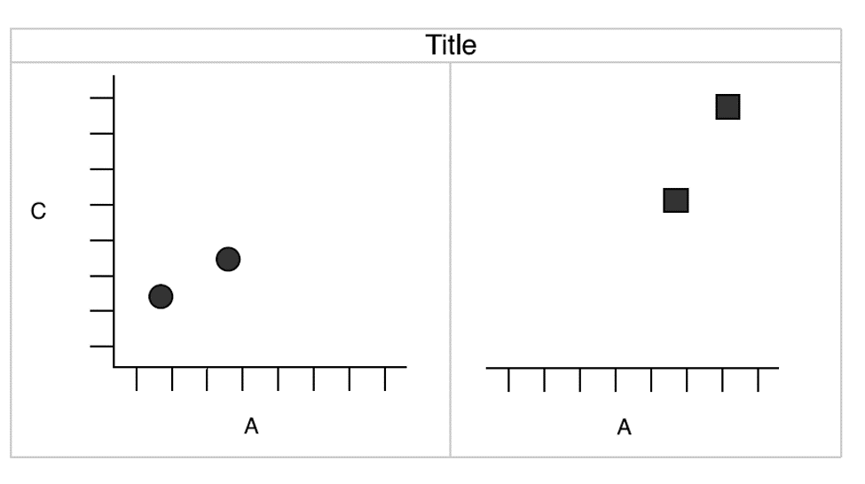
</p>
<p align="center" style="font-size: 0.775em">
  Wickham 2010
</p>


## Components of the plots

- Layers:
  - Dataset
  - Aesthetic mapping (color, shape, size, etc.)
  - Statistical transformation
  - Geometric object (line, bar, dots, etc.)
  - Position adjustment
- Scale (optional)
- Coordinate system
- Faceting (optional)
- Defaults

## ggplot2 full syntax
ggplot2 full syntax actually is following up the above layered grammar.

```r
ggplot(data = <DATASET>,
       mapping = aes( <MAPPINGS>) +
        layer(geom = <GEOM>,
              stat = <STAT>,
              position = <POSITION>) +
        <SCALE_FUNCTION>() +
        <COORDINATE_FUNCTION>() +
        <FACET_FUNCTION>()
```

### Previous example
Let's get back to the previous example.

```r
df <- data.frame(
  A = c(2, 1, 4, 9),
  B = c(3, 2, 5, 10),
  C = c(4, 1, 15, 80),
  D = c("a", "a", "b", "b")
)
df
```

```
##   A  B  C D
## 1 2  3  4 a
## 2 1  2  1 a
## 3 4  5 15 b
## 4 9 10 80 b
```

> ### Questions?
> - What kind of layers?
>   - Dataset?
>   - Aesthetic mapping?
>   - Statistical transformation?
>   - Geometric object?
>   - Position adjustment?
> - Scale?
> - Coordinate system?
> - Faceting?


Let's make a simple ggplot2 plot based on the previous example.

```r
ggplot(data = df,
       mapping = aes(x = A, y = C, shape = D)) +
  layer(geom = "point",
        stat = "identity",
        position = "identity") +
  scale_x_continuous() +
  scale_y_continuous() +
  coord_cartesian() +
  facet_null()
```


<p align="center">
  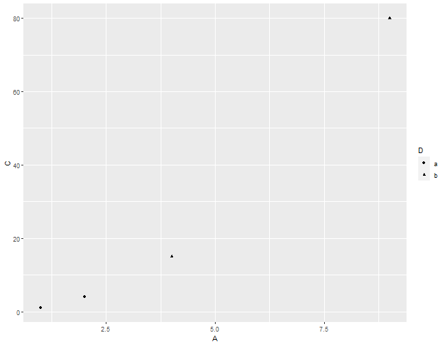
</p>
<p align="center" style="font-size: 0.775em">
  I know it's a little off from the previous example. We will cover how to adjust the background, dot size, font, etc. in the rest of the semester.
</p>

<p align="center">
  
</p>
<p align="center" style="font-size: 0.775em">
  Previous example.
</p>

### Facetting with grid

```r
ggplot(data = df,
       mapping = aes(x = A, y = C, shape = D)) +
  layer(geom = "point",
        stat = "identity",
        position = "identity") +
  scale_x_continuous() +
  scale_y_continuous() +
  coord_cartesian() +
  facet_grid( ~ D)
```

<p align="center">
  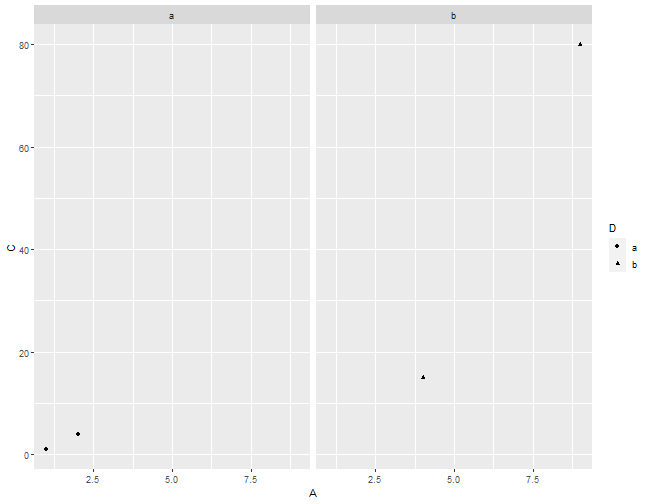
</p>
<p align="center" style="font-size: 0.775em">
  Facetting with grid.
</p>
<p align="center">
  
</p>
<p align="center" style="font-size: 0.775em">
  Previous example.
</p>


## A typical ggplot2
In general, we don't use full syntax of ggplot2 for our daily work.

We commonly use the following:

```r
ggplot(data = <DATASET> ,
      mapping = aes(<MAPPINGS)) +
<GEOM_FUNCTION>()
```

### With geom_ function
```r
ggplot(data = df, mapping = aes(x = A, y = C, shape = D)) +
  geom_point()+
  facet_grid( ~ D)
```
<p align="center">
  
</p>

### Dataset - Fuel economy in cars
```r
library(tidyverse)
```

```r
head(mpg,5)
```
```
## # A tibble: 5 x 11
##   manufacturer model displ  year   cyl trans      drv     cty   hwy fl    class
##   <chr>        <chr> <dbl> <int> <int> <chr>      <chr> <int> <int> <chr> <chr>
## 1 audi         a4      1.8  1999     4 auto(l5)   f        18    29 p     compa~
## 2 audi         a4      1.8  1999     4 manual(m5) f        21    29 p     compa~
## 3 audi         a4      2    2008     4 manual(m6) f        20    31 p     compa~
## 4 audi         a4      2    2008     4 auto(av)   f        21    30 p     compa~
## 5 audi         a4      2.8  1999     6 auto(l5)   f        16    26 p     compa~
```

### Dataset - Interviewing data

```r
mpg[,c("displ","hwy")]
```

```
## # A tibble: 234 x 2
##    displ   hwy
##    <dbl> <int>
##  1   1.8    29
##  2   1.8    29
##  3   2      31
##  4   2      30
##  5   2.8    26
##  6   2.8    26
##  7   3.1    27
##  8   1.8    26
##  9   1.8    25
## 10   2      28
## # ... with 224 more rows
```

### Dataset - Creating base
```r
ggplot(data = mpg)
```
<p align="center">
  
</p>

### Dataset - Creating plot
```r
ggplot(data = mpg) +
  geom_point(mapping = aes(x = displ, y = hwy))
```
<p align="center">
  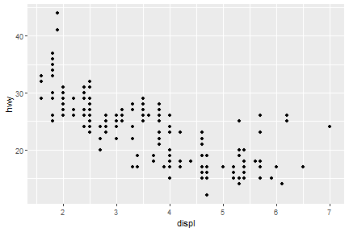
</p>

> ## Exercise
> - How many rows are in mtcars? How many columns?
> - What does the drv variable describe? Read the help for ?mpg to find out.
> - Make a scatterplot of hwy versus cyl.

### Aesthetic mappings

We can change levels of size, shape, color, fill, alpha etc. inside of `aes()`

```r
ggplot(data = mpg) +
  geom_point(mapping = aes(x = displ, y = hwy, color = class))
```
<p align="center">
  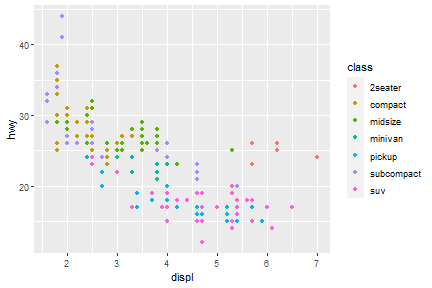
</p>

**Well, if you prefer British English, you can use `colour` instead of `color`**. In package of `tidyverse`, you may see couple of function/arguments works for either British/US English.

### Aesthetic mappings - outside of aes()
You can also set the aesthetic properties of your geom manually.

```r
ggplot(data = mpg) +
  geom_point(mapping = aes(x = displ, y = hwy), color = "red")
```
<p align="center">
  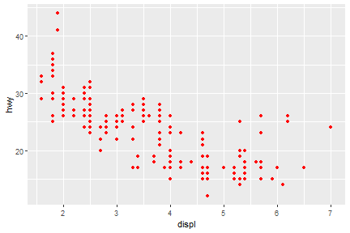
</p>

Here, the color doesn’t convey information about a variable, but only changes the appearance of the plot.

Some rules for changing the color/size/shape.
- The name of a color as a character string

- The size of a point in mm

- The shape of a point as a number

> ## 25 built-in shapes identified by numbers
> <p align="center">
>   
> </p>

### geom_() functions
- Geometric object
- Statistical transformation
- Position adjustment

#### Common geom functions with geometric objects

- geom_bar, bar chart

- geom_histogram, histogram

- geom_point, scatterplot

- geom_qq, quantile-quantile plot

- geom_boxplot, boxplot

- geom_line, line chart

#### Statistical transformation

<p align="center">
  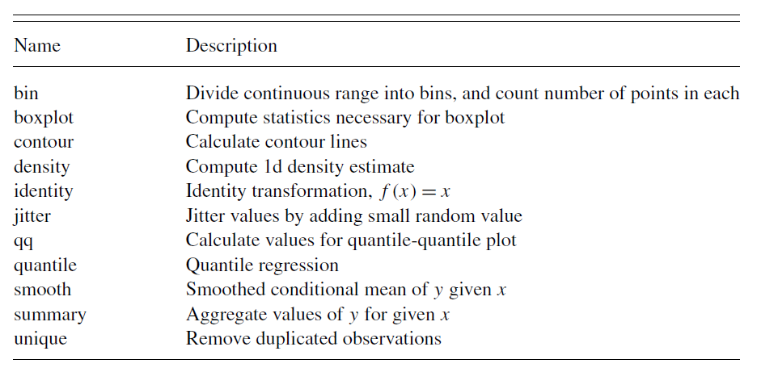
</p>
<p align="center" style="font-size: 0.775em">
  Wickham 2010.
</p>

#### Common geom with statistical transformation
Typically, you will create layers using a geom_ function.

- geom_bar, bar chart
  - stat="count"
- geom_histogram, histogram
  - stat="bin"
- geom_point, scatterplot
  - stat="identity"
- geom_qq, quantile-quantile plot
  - stat="qq"
- geom_boxplot, boxplot
  - stat="boxplot"
- geom_line, line chart
  - stat="identity"

#### The defaults stat and position of geom_

Check the documentation
```r
?geom_line
```
Check the function

```r
geom_line
```

```
## function (mapping = NULL, data = NULL, stat = "identity", position = "identity",
##     na.rm = FALSE, orientation = NA, show.legend = NA, inherit.aes = TRUE,
##     ...)
## {
##     layer(data = data, mapping = mapping, stat = stat, geom = GeomLine,
##         position = position, show.legend = show.legend, inherit.aes = inherit.aes,
##         params = list(na.rm = na.rm, orientation = orientation,
##             ...))
## }
## <bytecode: 0x000000001281e898>
## <environment: namespace:ggplot2>
```

#### Set of rules
- Use `geom_ function` to make variables visible on the screen.
- Use `stat_ function` and define geom shape as an argument inside `geom_`.
- Or use `geom_` and define statistical transformation as an argument inside stat_.

#### Common geom with position adjustments
point: `geom_point`, `geom_jitter`

### Scale syntax

```r
scale_<name>_<prepacked scale>()
```

Several common scale functions:
```r
labs() xlab() ylab() ggtitle()
lims() xlim() ylim()
scale_colour_brewer()
scale_colour_continuous()
```

#### Scale example
```r
ggplot(data = mpg) +
  geom_point(mapping = aes(x = displ, y = hwy, color=hwy))+
  scale_colour_continuous(type="viridis")
```
<p align="center">
  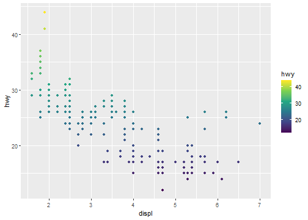
</p>

### Coordinate system

```r
ggplot(data = mpg) +
  geom_point(mapping = aes(x = displ, y = hwy))+
  coord_polar()
```
<p align="center">
  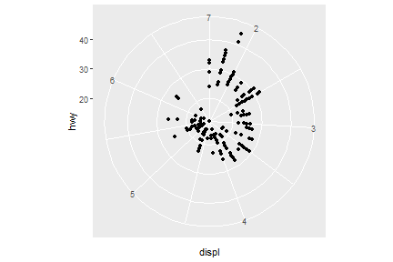
</p>

### Faceting
### `facet_grid`
```r
ggplot(data = mpg) +
  geom_point(mapping = aes(x = displ, y = hwy))+
  facet_grid(.~year)
```
<p align="center">
  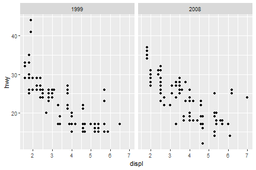
</p>

### `facet_wrap`
```r
ggplot(data = mpg) +
  geom_point(mapping = aes(x = displ, y = hwy))+
  facet_wrap(.~cyl)
```
<p align="center">
  
</p>

***

## A more complicated-embedded grammar

<p align="center">
  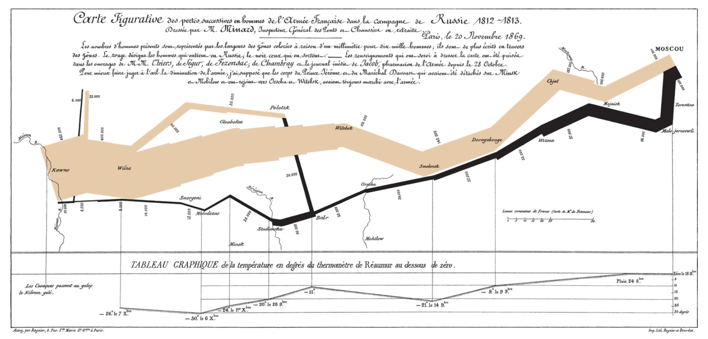
</p>

**The map of Napoleon's Russian campaign**

**Charles Joseph Minard** is best known for his cartographic depiction of numerical data on a map of Napoleon's disastrous losses suffered during the Russian campaign of 1812 (in French, Carte figurative des pertes successives en hommes de l'Armée Française dans la campagne de Russie 1812–1813). The illustration depicts Napoleon's army departing the Polish-Russian border. A thick band illustrates the size of his army at specific geographic points during their advance and retreat. It displays six types of data in two dimensions: the number of Napoleon's troops; the distance traveled; temperature; latitude and longitude; direction of travel; and location relative to specific dates without making mention of Napoleon; Minard's interest lay with the travails and sacrifices of the soldiers. This type of band graph for illustration of flows was later called a Sankey diagram, although Matthew Henry Phineas Riall Sankey used this visualisation 30 years later and only for thematic energy flow. - [Wiki](https://en.wikipedia.org/wiki/Charles_Joseph_Minard)

Let's reproduce the top part of Minard’s famous depiction of Napoleon’s march on Russia.

This graphic can be thought of as a compound graphic:

- The top part displays the number of troops during the advance and the retreat
- The bottom part shows the temperature during the advance
-
We will focus on the top part of the graphic. This part displays two datasets: cities and troops. Each city has a position (a latitude and longitude) and a name, and each troop observation has a position, a direction (advance or retreat), and number of survivors.


### Load data: minard-troops.txt and minard-cities.txt

Supplemental files for "A layered grammar of graphics"

* [minard-cities.txt](data/minard-cities.txt): Location of cities in **Napoleon's march** by Minard.
* [minard-troops.txt](data/minard-troops.txt): Troop movement data.

```r
troops <- read.table("minard-troops.txt", header=T)
cities <- read.table("minard-cities.txt", header=T)
```

#### `troops`
```r
head(troops)
```

```
##   long  lat survivors direction group
## 1 24.0 54.9    340000         A     1
## 2 24.5 55.0    340000         A     1
## 3 25.5 54.5    340000         A     1
## 4 26.0 54.7    320000         A     1
## 5 27.0 54.8    300000         A     1
## 6 28.0 54.9    280000         A     1
```

#### `cities`
```r
head(cities)
```

```
##   long  lat      city
## 1 24.0 55.0     Kowno
## 2 25.3 54.7     Wilna
## 3 26.4 54.4  Smorgoni
## 4 26.8 54.3 Moiodexno
## 5 27.7 55.2 Gloubokoe
## 6 27.6 53.9     Minsk
```

### How would we create this graphic with the layered grammar?

- Start with the essence of the graphic: a path plot of the troops data, mapping direction to color and number of survivors to size.
- Then take the position of the cities as an additional layer
- Then polish the plot by carefully tweaking the default scales


Start with the essence of the graphic: a path plot of the troops data, mapping direction to color and number of survivors to size.

```r
plot_troops <- ggplot(troops, aes(long, lat)) +
  geom_path(aes(size = survivors, colour = direction, group = group))
plot_troops
```

<p align="center">
  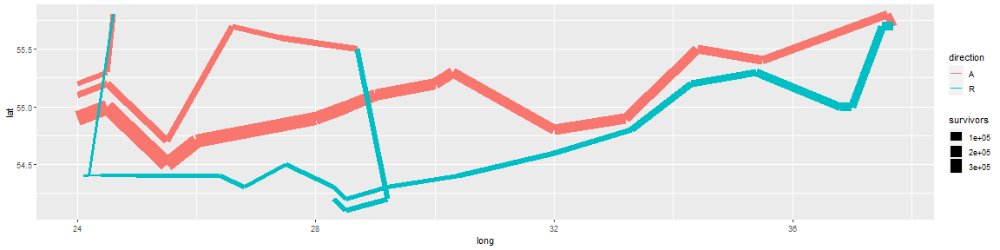
</p>

Then take the position of the cities as an additional layer.

```r
plot_both <- plot_troops +
  geom_text(aes(label = city), size = 4, data = cities)
plot_both
```

<p align="center">
  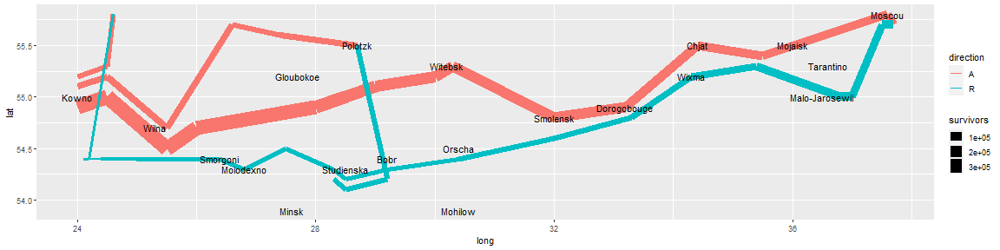
</p>


Then polish the plot by carefully tweaking the default scales.
```r
plot_polished <- plot_both +
  scale_size(
    range = c(0, 12),
    # breaks = c(10000, 20000, 30000),
    # labels = c("10,000", "20,000", "30,000")
  ) +
  scale_color_manual(values = c("tan", "grey50")) +
  coord_map() +
  labs(title = "Map of Napoleon's Russian campaign of 1812") +
  theme_void() +
  theme(legend.position = "none")
plot_polished
```

<p align="center">
  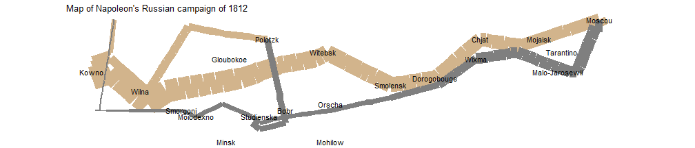
</p>

I admitted that there is still huge room to improve this plot, but it gives us some taste of how to use R to mimic this classical visualization created hundred years ago by Minard.

#### References
[1] [Hadley Wickham, Garrett Grolemund. R For Data Science.](https://r4ds.had.co.nz/) \
[2] [Hadley Wickham, A layered grammar of graphics](https://vita.had.co.nz/papers/layered-grammar.pdf)
[3] [ggplot2 references](https://ggplot2.tidyverse.org/reference/)
