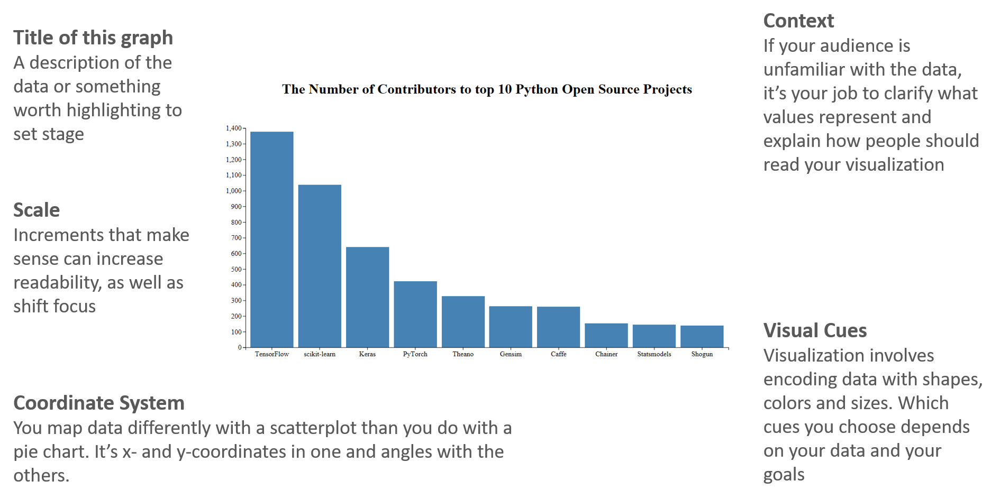
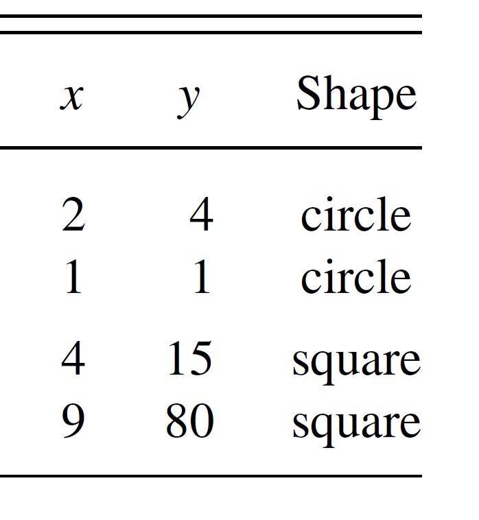
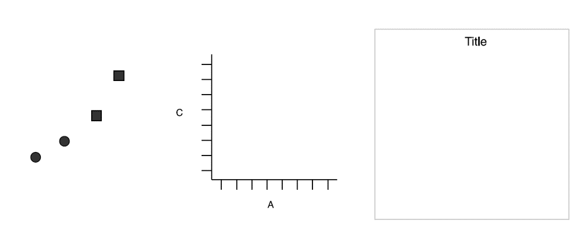

# The Grammar of Graphics

## Common plots

Common statistical plots:
- Bar chart
- Scatter plot
- Line chart
- Box plot
- Histogram

The followings are the general rules for common plots, but theses can always be changed:

Scatter plot

- continuous varialbe vs continuous variable

Line plot

- continuous varialbe vs continuous variable

Box plot

- categorical varialbe vs continuous variable

Histogram

- continuous variable vs continuous variable

Bar chart

- categorical varialbe vs continuous variable

## What make a basic plot

  

The components for a basic plot.

Let's draw a scatterplot of **A** vs **C**.

  

  Wickham, Hadley. A Layered Grammar of Graphics.

Then Mapping A to x-position, C to y-position, and D to shape

  

  Wickham, Hadley. A Layered Grammar of Graphics.

Here we have three basic layers:
- Geometric objects
- Scales
- Coordinate system (From left to right)

  

  Three basic layers. Wickham.

#### References
[1] [Hadley Wickham, Garrett Grolemund. R For Data Science.](https://r4ds.had.co.nz/) \
[2] [Hadley Wickham, A layered grammar of graphics](https://vita.had.co.nz/papers/layered-grammar.pdf)
