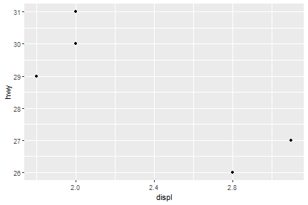
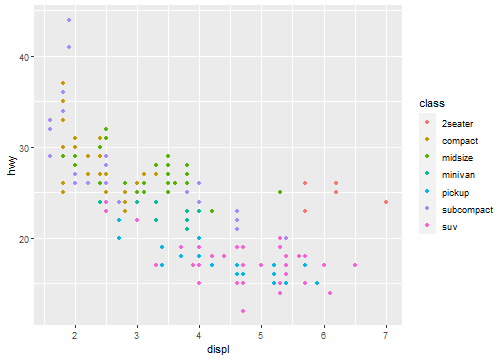
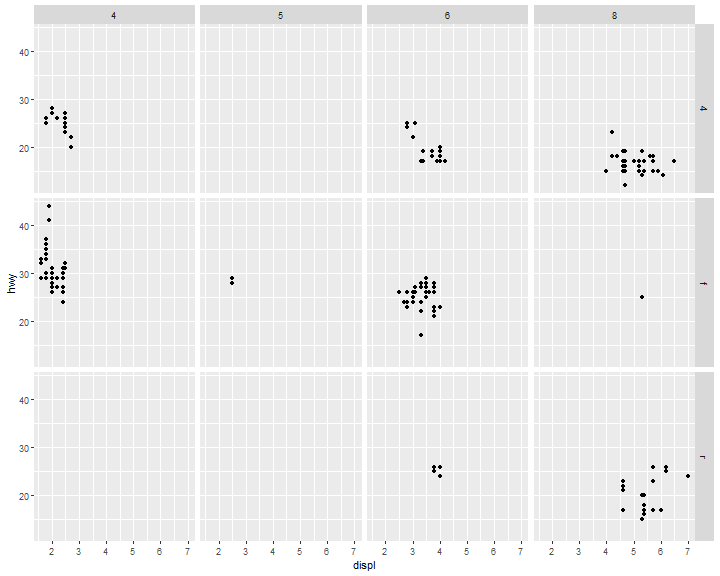
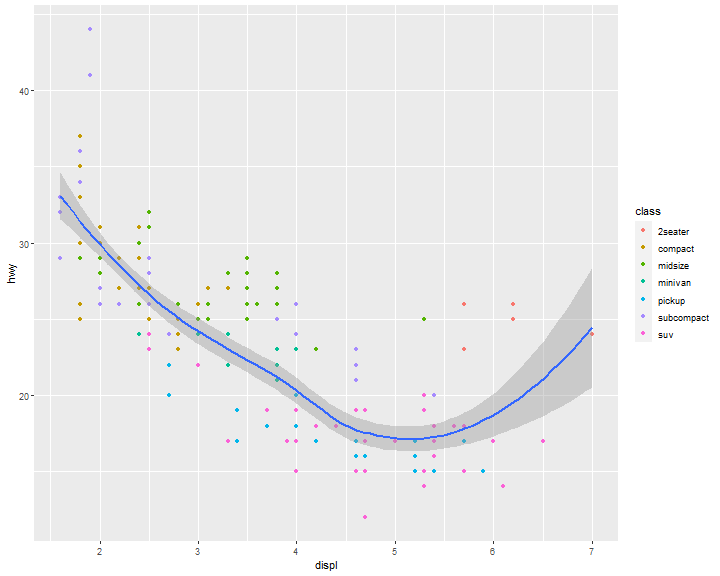
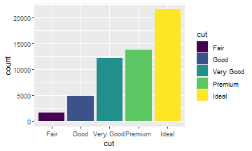
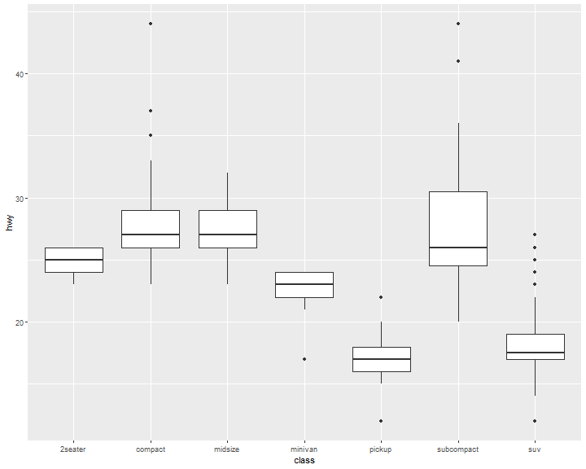
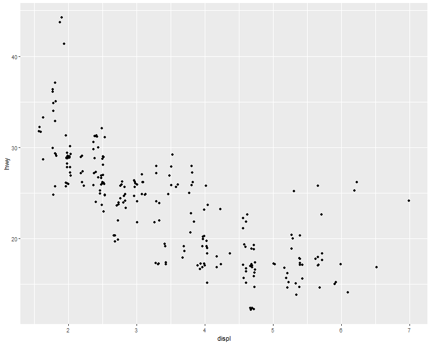

# Basic Data Visualization in R

## Chart selection

A great explanation on selecting a right chart type by Dr. Andrew Abela.

but as a data scientist should not be limited by this.

<p align="center">
  
</p>

## Components of the plots

- Layers:
  - Dataset
  - Aesthetic mapping (color, shape, size, etc.)
  - Statistical transformation
  - Geometric object (line, bar, dots, etc.)
  - Position adjustment
- Scale (optional)
- Coordinate system
- Faceting (optional)
- Defaults

## ggplot2 full syntax

```r
ggplot(data = <DATASET>,
       mapping = aes( <MAPPINGS>) +
        layer(geom = <GEOM>,
              stat = <STAT>,
              position = <POSITION>) +
        <SCALE_FUNCTION>() +
        <COORDINATE_FUNCTION>() +
        <FACET_FUNCTION>()
```

### A typical graph template

```r
ggplot(data = <DATASET> ,
      mapping = aes(<MAPPINGS)) +
      <GEOM_FUNCTION>()
```

## Creat a plot with basic data

```r
ggplot(data=mpg)+
  geom_point(mapping = aes(x=displ>2,y=hwy))
```
<p align="center">
  
</p>

```r
ggplot(data=mpg[mpg$model=="a4",])+
  geom_point(mapping = aes(x=displ,y=hwy))
```
<p align="center">
  
</p>

## Aesthetic Mappings

The greatest value of a picture is when it forces us to notice what we never expected to see.

—John Tukey

Basic components of aesthetic mapping:
- Mapping
- Size
- Alpha
- Shape
- Color

Map the colors of your points to the class variable to reveal the class of each car:

### Aesthetic Mappings: Mapping
```r
ggplot(data = mpg) +
  geom_point(mapping = aes(x = displ, y = hwy, color = class))
```
<p align="center">
  
</p>

### Aesthetic Mappings: Size

Not recommend mapping an unordered variable to an ordered aesthetic:

```r
ggplot(data = mpg) +
  geom_point(mapping = aes(x = displ, y = hwy, size = class))
```
<p align="center">
  
</p>

### Aesthetic Mappings: Alpha

```r
ggplot(data = mpg) +
  geom_point(mapping = aes(x = displ, y = hwy, alpha = class))
```
<p align="center">
  
</p>

### Aesthetic Mappings: Shape
```r
ggplot(data = mpg) +
  geom_point(mapping = aes(x = displ, y = hwy, shape = class))
```
<p align="center">
  
</p>


> What happened to the SUVs? ggplot2 will only use six shapes at a time.
>
> By default, additional groups will go unplotted when you use this aesthetic.

R has 25 built-in shapes that are identified by numbers
<p align="center">
  
</p>


### Aesthetic Mappings: Color

For each aesthetic you use, the aes() to associate the name of the aesthetic with a variable to display. The aes() function gathers together each of the aesthetic mappings used by a layer and passes them to the layer’s mapping argument.
```r
ggplot(data = mpg) +
  geom_point(mapping = aes(x = displ, y = hwy), color = "blue")
```
<p align="center">
  
</p>


> ## Exercise
> - Which variables in mpg are categorical? Which variables are continuous? (Hint: type ?mpg to read the documentation for the dataset.) How can you see this information when you run mpg?
>
> - Map a continuous variable to color, size, and shape. How do these aesthetics behave differently for categorical versus continuous variables?


## Facets

### Facets: `facet_wrap()`


The first argument of facet_wrap() should be a formula, which you create with ~ followed by a variable name (here “formula” is the name of a data structure in R, not a synonym for “equation”).
To facet your plot by a single variable (discrete), use facet_wrap()

```r
ggplot(data = mpg) +
  geom_point(mapping = aes(x = displ, y = hwy)) +
  facet_wrap( ~ class, nrow = 2)
```

<p align="center">
  
</p>


### Facets: `facet_grid()`

To facet your plot on the combination of two variables, add facet_grid() to your plot call.


```r
ggplot(data = mpg) +
  geom_point(mapping = aes(x = displ, y = hwy)) +
  facet_grid(drv ~ cyl)
```

<p align="center">
  
</p>

>**Tip**:
>
>If you want to use `facet_wrap` to do the above plot.
>```r
>ggplot(data = mpg) +
>  geom_point(mapping = aes(x = displ, y = hwy)) +
>  facet_wrap(drv ~ cyl)
>```
>You will see,
><p align="center">
>  
></p>
>This is the difference between `facet_wrap` and `facet_grid`.

## Geometric Objects
A geom is the geometrical object that a plot uses to represent data. People often describe plots by the type of geom that the plot uses. For example, bar charts use bar geoms, line charts use line geoms, boxplots use boxplot geoms, and so on.


```r
ggplot(data = mpg) +
  geom_point(mapping = aes(x = displ, y = hwy))
```

<p align="center">
  
</p>

*`geom_smooth()`: 95% confidence level interval for predictions*

```r
ggplot(data = mpg) +
  geom_smooth(mapping = aes(x = displ, y = hwy))
```

<p align="center">
  
</p>

What if we would like to group the `smooth_line` by drv?

```r
ggplot(data = mpg) +
  geom_smooth(mapping = aes(x = displ, y = hwy, group = drv))
```

<p align="center">
  
</p>

Now, arrange colors on different type of drv.

```r
ggplot(data = mpg) +
  geom_smooth(mapping = aes(x = displ, y = hwy, color = drv),
  show.legend = FALSE)
```

<p align="center">
  
</p>


We can also add up one more geom layer to the current one.

```r
ggplot(data = mpg) +
  geom_point(mapping = aes(x = displ, y = hwy)) +
  geom_smooth(mapping = aes(x = displ, y = hwy))
```
<p align="center">
  
</p>

### Global and local mappings

```r
ggplot(data = mpg) +
  geom_point(mapping = aes(x = displ, y = hwy)) +
  geom_smooth(mapping = aes(x = displ, y = hwy))
```

ggplot2 will treat these mappings as global mappings that apply to each geom in the graph. In other words, this code will produce the same plot as the previous code:

```r
ggplot(data = mpg, mapping = aes(x = displ, y = hwy)) +
  geom_point() +
  geom_smooth()
```

#### Local mappings

```r
ggplot(data = mpg) +
  geom_point(mapping = aes(x = displ, y = hwy)) +
  geom_smooth(mapping = aes(x = displ, y = hwy, color=class))
```

<p align="center">
  
</p>


#### Global mapping

```r
ggplot(data = mpg, mapping = aes(x = displ, y = hwy, color=class)) +
  geom_point() +
  geom_smooth()
```

<p align="center">
  
</p>


Change the color for `geom_point` layer only.

```r
ggplot(data = mpg, mapping = aes(x = displ, y = hwy)) +
  geom_point(mapping = aes(color = class)) +
  geom_smooth()
```
<p align="center">
  
</p>

#### Filter out data in a layer

```r
ggplot(data = mpg, mapping = aes(x = displ, y = hwy)) +
  geom_point(mapping = aes(color = class)) +
  geom_smooth(data = mpg[mpg$class == "subcompact", ],
  se = FALSE)
```

<p align="center">
  
</p>


```r
ggplot(data = mpg, mapping = aes(x = displ, y = hwy)) +
  geom_point(mapping = aes(color = cty>16))
```

<p align="center">
  
</p>

```r
ggplot(data = mpg, mapping = aes(x = displ>4, y = cty)) +
  geom_boxplot()
```

<p align="center">
  
</p>

### `as.factor()`

```r
ggplot(mpg, aes(x = displ, y = hwy)) +
  geom_point(aes(color = as.factor(cty)), size=5)
```

<p align="center">
  
</p>


>**Exercise 1**
>
>Re-create the R code necessary to generate the following graphs.
>
>a             |  b
>:----:|:----:
>  |  

a
```r
ggplot(mpg,
       aes(x = displ, y = hwy)) +
  geom_point(size=5) +
  geom_smooth(se=F)
```

b
```r
ggplot(mpg,
       aes(x = displ, y = hwy)) +
  geom_point(size=5) +
  geom_smooth(aes(class=drv),se=F)
```

>**Exercise 2**
>
>Re-create the R code necessary to generate the following graphs.
>
>a             |  b
>:----:|:----:
>  |  

a
```r
ggplot(mpg,
       aes(x = displ, y = hwy)) +
  geom_point(aes(color=drv)) +
  geom_smooth(aes(class=drv, color=drv),se=F)
```

b
```r
ggplot(mpg,
       aes(x = displ, y = hwy)) +
  geom_point(aes(color=drv)) +
  geom_smooth(se=F)
```


>**Exercise 3**
>
>Re-create the R code necessary to generate the following graphs.
>
>a             |  b
>:----:|:----:
>  |  

a
```r
ggplot(mpg,
       aes(x = displ, y = hwy)) +
  geom_point(aes(color=drv)) +
  geom_smooth(aes(class=drv, color=drv, shape=drv, linetype=drv),se=F)
```

b
```r
ggplot(mpg,
       aes(x = displ, y = hwy)) +
  geom_point(aes(fill=drv), shape=21, color="white", size=5, stroke=5) +
  geom_smooth(se=F)
```

### Statistical transformation
Many graphs, like scatterplots, plot the raw values of your dataset. Other graphs,
like bar charts, calculate new values to plot.

The algorithm used to calculate new values for a graph is called a stat, short for
statistical transformation. The following figure describes how this process works with geom_bar().


<p align="center">
  
</p>

The diamonds dataset comes in ggplot2 and contains information about ~54,000 diamonds, including the price, carat, color, clarity, and cut of each diamond. The chart shows that more diamonds are available with high-quality cuts than with low quality cuts:

```r
ggplot(data = diamonds) +
  geom_bar(mapping = aes(x = cut))
```

<p align="center">
  
</p>


#### Common geom with statistical transformation

Typically, you will create layers using a `geom_ function`.

- geom_bar, bar chart
  - stat="count"
- geom_histogram, histogram
  - stat="bin"
- geom_point, scatterplot
  - stat="identity"
- geom_qq, quantile-quantile plot
  - stat="qq"
- geom_boxplot, boxplot
  - stat="boxplot"
- geom_line, line chart
  - stat="identity"

**Therefore, we can use `stat` function instead of `geom`.**

As we mentioned in the previous class, each stat has a default geom function.

- stat_count
- stat_qq
- stat_identity
- stat_bin
- stat_boxplot

#### `stat_count`

`geom_bar` shows the default value for stat is “count,” which means that `geom_bar()` uses `stat_count()`.

`geom_bar()` uses `stat_count()` by default: it counts the number of cases at each `x` position.

For example, you can re-create the previous plot using `stat_count()` instead of `geom_bar()`:

```r
ggplot(data = diamonds) +
  stat_count(mapping = aes(x = cut))
```

<p align="center">
  
</p>

#### `stat_qq`

```r
ggplot(mpg)+
  stat_qq(aes(sample=cty))
```

<p align="center">
  
</p>

#### `stat_identity`

```r
ggplot(mpg)+
  stat_identity(aes(displ,cty))
```

<p align="center">
  
</p>

#### `stat_bin`

```r
ggplot(mpg)+
  stat_bin(aes(cty))
```

<p align="center">
  
</p>

#### `stat_boxplot`

```r
ggplot(mpg)+
  stat_boxplot(aes(class,cty))
```

<p align="center">
  
</p>


#### Identity stat

If you want the y axis of bar chart to represent values instead of count, use `stat="identity"`

```r
ggplot(data = diamonds) +
  geom_bar(mapping = aes(x = cut, y=price), stat="identity")
```


<p align="center">
  
</p>

If you want the heights of the bars to represent values in the data, use geom_col() instead, which is the identity stat version of geom_bar

```r
ggplot(data = diamonds) +
  geom_col(mapping = aes(x = cut, y=price))
```

<p align="center">
  
</p>

#### Stat proportion

```r
ggplot(data = diamonds) +
  geom_bar(mapping = aes(x = cut, y = ..prop.., group = 1))
```
<p align="center">
  
</p>


### Position Adjustments

There’s one more piece of magic associated with bar charts. You can color a bar chart using either the color aesthetic, or more usefully, fill:

```r
ggplot(data = diamonds) +
  geom_bar(aes(x = cut,
               color = cut))
```
<p align="center">
  
</p>

```r
ggplot(data = diamonds) +
  geom_bar(aes(x = cut,
               fill = cut))
```
<p align="center">
  
</p>

#### Position Adjustments: stack

Note what happens if you map the fill aesthetic to another variable, like clarity: the bars are automatically stacked. Each colored rectangle represents a combination of cut and clarity:
```r
ggplot(data = diamonds) +
  geom_bar(mapping = aes(x = cut, fill = clarity))
```
<p align="center">
  
</p>

#### Position Adjustments: identity
`position = "identity"` will place each object exactly where it falls in the context of the graph.
This is not very useful for bars, because it overlaps them.
```r
ggplot(data = diamonds,
       mapping = aes(x = cut, fill = clarity)) +
       geom_bar(position = "identity")
```

<p align="center">
  
</p>
Well, you may notice something wrong here. (Yes)

To be clearer, we change the transparancy of the bars.
```r
ggplot(data = diamonds,
       mapping = aes(x = cut, fill = clarity)) +
       geom_bar(alpha=1/5,position = "identity")
```

Did you notice that some of the bars are overlaping?
<p align="center">
  
</p>

Therefore, we need to be careful with `identity`.

You may use the following methods to fix this issue.


#### Position Adjustments: fill
`position = "fill"` works like stacking, but makes each set of stacked bars the same height. This makes it easier to compare proportions across groups:

```r
ggplot(data = diamonds) +
  geom_bar(mapping = aes(x = cut, fill = clarity),
  position = "fill")
```

<p align="center">
  
</p>

#### Position Adjustments: dodge

`position = "dodge"` places overlapping objects directly beside one another. This makes it easier to compare individual values:

```r
ggplot(data = diamonds) +
  geom_bar(mapping = aes(x = cut, fill = clarity),
  position = "dodge")
```
<p align="center">
  
</p>

#### Position Adjustments: jitter

There’s one other type of adjustment that’s not useful for bar charts, but it can be very useful for scatterplots. Recall our first scatterplot. Did you notice that the plot displays only 126 points, even though there are 234 observations in the dataset?
```r
ggplot(data = mpg) +
  geom_point(mapping = aes(x = displ, y = hwy))
```

<p align="center">
  
</p>


`position = "jitter"` adds a small amount of random noise to each point. This spreads the points out because no two points are likely to receive the same amount of random noise:
```r
ggplot(data = mpg) +
  geom_point(mapping = aes(x = displ, y = hwy),
  position = "jitter")
```

<p align="center">
  
</p>

#### Dual y axis

Two y variables with one y axis, the cty is shifted down.
```r
ggplot(data = mpg) +
  geom_point(mapping = aes(x = displ, y = hwy)) +
  geom_smooth(mapping = aes(x = displ, y = cty))
```
<p align="center">
  
</p>

`sec_axis()` function is able to deal with dual axis
```r
ggplot(data = mpg) +
  geom_point(mapping = aes(x = displ, y = hwy)) +
  geom_smooth(mapping = aes(x = displ, y = cty))+
    scale_y_continuous(sec.axis = sec_axis(~.*0.7, name = "cty"))
```
<p align="center">
  
</p>


### Coordinate Systems

Coordinate systems are probably the most complicated part of ggplot2. The default coordinate system is the Cartesian coordinate system where the x and y position act independently to find the location of each point.

```r
# first: install.packages(c("maps","mapproj")) ----
# then ----
sw <- map_data("state",
               region = c("texas",
                          "oklahoma",
                          "louisiana"))
ggplot(sw) +
  geom_polygon(
    mapping = aes(x = long,
                  y = lat,
                  group = group),
    fill = NA,
    color = "black"
  ) +
  coord_map()
```
<p align="center">
  
</p>

**But what if we don't have geocode information**

1. ggmap package will return geocodes from cities' name. However, as of mid-2018, google map requires a registered API key, which needs a valid credit card (SAD!).
2. Therefore, we have to find an altervative way. You could find geocodes data table included cities name on: census.gov or other open liscence sources, e.g. ods.

Then, how to connect geocode table with our original data table by using base function?

#### Merge geocode with city's name or zip or both
```r
cities <-
  data.frame(
    City = c("Boston", "Newton", "Cambridge"),
    Zip = c(2110, 28658, 5444)
  )
gcode <-
  read.csv("E:/IE6600/materials/R/R/hwData/usZipGeo.csv", sep = ";")
newCities <-
  merge(cities, gcode, by.x = c("City", "Zip")) %>%
  subset(select = c("City", "Zip", "Longitude", "Latitude"))
newCities
```

```
##        City   Zip Longitude Latitude
## 1    Boston  2110 -71.05365 42.35653
## 2 Cambridge  5444 -72.90151 44.64565
## 3    Newton 28658 -81.23443 35.65344
```

#### Coordinate Systems: polar

For example, first we do a barchart based on the `diamonds` dataset.
```r
ggplot(data = diamonds) +
  geom_bar(
    mapping = aes(x = cut, fill = cut),
    show.legend = FALSE,
    width = 1
  ) +
  theme(aspect.ratio = 1) +
  labs(x = NULL, y = NULL)+
  coord_flip()
```
<p align="center">
  
</p>

Then we convert it to a polar system by using `coord_polar()`.
```r
ggplot(data = diamonds) +
  geom_bar(
    mapping = aes(x = cut, fill = cut),
    show.legend = FALSE,
    width = 1
  ) +
  theme(aspect.ratio = 1) +
  labs(x = NULL, y = NULL)+
  coord_polar()
```
<p align="center">
  
</p>

### Bar chart vs Histogram
```r
ggplot(data = mpg, mapping = aes(x=drv)) +
    geom_bar()
```
<p align="center">
  
</p>


```r
ggplot(data = mpg, mapping = aes(x=cty)) +
  geom_histogram()
```
<p align="center">
  
</p>


### Boxplot
```r
ggplot(data = mpg, mapping = aes(x = class, y = hwy)) +
  geom_boxplot()
```

<p align="center">
  
</p>

```r
ggplot(data = mpg, mapping = aes(x = class, y = hwy)) +
  geom_boxplot(aes(color=class))
```

<p align="center">
  
</p>

### Scatter plot
```r
ggplot(data = mpg,
       mapping = aes(x = displ, y = hwy)) +
       geom_point()
```
<p align="center">
  
</p>
What do you think of this plot? Can it be improved?

### Jitter
```r
ggplot(data = mpg,
       mapping = aes(x = displ, y = hwy)) +
       geom_point(position = "jitter")
```
<p align="center">
  
</p>
Better?

### Avoid overlapping

```r
ggplot(diamonds, mapping = aes(x = carat, y = price)) +
  geom_point()
```

<p align="center">
  
</p>

#### Avoid overlapping: Change size

```r
ggplot(diamonds, mapping=aes(x=carat, y=price)) +
  geom_point(size=0.1)
```

<p align="center">
  
</p>

#### Avoid overlapping: Change alpha
```r
ggplot(diamonds, mapping=aes(x=carat, y=price)) +
  geom_point(alpha=0.1)
```
<p align="center">
  
</p>


#### References
[1] [Dr. Andrew Abela, Choosing a good chart](http://extremepresentation.typepad.com/files/choosing-a-good-chart-09.pdf) \
[2] [Hadley Wickham, Garrett Grolemund. R For Data Science.](https://r4ds.had.co.nz/) \
[3] [Hadley Wickham, A layered grammar of graphics](https://vita.had.co.nz/papers/layered-grammar.pdf)\
[4] [Winston Chang, R Graphics Cookbook](https://r-graphics.org/)
