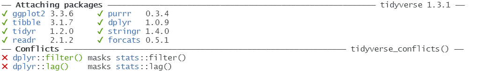

# Data Transformation with dplyr


Often you’ll need to create some new variables or summaries, or maybe you just want to rename the variables or reorder the observations in order to make the data a little easier to work with.

```r
# Needed libraries ----
library(nycflights13)
library(dplyr)
#or ----
library(tidyverse)
```
<p align="center">
  
</p>

The conflict message tells you some of the other functions have been overwrited by Tidyverse. If you want to use the base version of these functions after loading dplyr, you’ll need to use their full names: stats::filter() and stats::lag(),etc.


## `search()`

```r
search()
```

```
##  [1] ".GlobalEnv"           "package:forcats"      "package:stringr"
##  [4] "package:dplyr"        "package:purrr"        "package:readr"
##  [7] "package:tidyr"        "package:tibble"       "package:ggplot2"
## [10] "package:tidyverse"    "package:nycflights13" "package:stats"
## [13] "package:graphics"     "package:grDevices"    "package:utils"
## [16] "package:datasets"     "package:methods"      "Autoloads"
## [19] "package:base"
```

You may use the full syntax `package::function_name()` to load the specific function, if there are any overwriting issues occured.

## Package `nycflights13`

To explore the basic data manipulation verbs of dplyr, we’ll use nycflights13::flights. This data frame contains all 336,776 flights that departed from New York City in 2013:


```r
head(flights)
```

```
## # A tibble: 6 × 19
##    year month   day dep_time sched_dep_time dep_delay arr_time sched_arr_time
##   <int> <int> <int>    <int>          <int>     <dbl>    <int>          <int>
## 1  2013     1     1      517            515         2      830            819
## 2  2013     1     1      533            529         4      850            830
## 3  2013     1     1      542            540         2      923            850
## 4  2013     1     1      544            545        -1     1004           1022
## 5  2013     1     1      554            600        -6      812            837
## 6  2013     1     1      554            558        -4      740            728
## # … with 11 more variables: arr_delay <dbl>, carrier <chr>, flight <int>,
## #   tailnum <chr>, origin <chr>, dest <chr>, air_time <dbl>, distance <dbl>,
## #   hour <dbl>, minute <dbl>, time_hour <dttm>
```

### Interview data with `view()`
```r
view(flights)
```

You might also have noticed the row of three- (or four-) letter abbreviations under the column names. These describe the type of each variable:

- **int** stands for integers.
- **dbl** stands for doubles, or real numbers.
- **chr** stands for character vectors, or strings.
- **dttm** stands for date-times (a date + a time).


**Flights actually is a tibble, a special type of `data.frame`. We will talk about it later.**

There are three other common types of variables that aren’t used in this dataset but you’ll encounter later.

- **lgl** stands for logical, vectors that contain only TRUE or FALSE.
- **fctr** stands for factors, which R uses to represent categorical variables with fixed possible values.
- **date** stands for dates.

## `dplyr`

You are going to learn the five key `dplyr` functions that allow you to solve the vast majority of your data-manipulation challenges:

- `filter()` pick observations by their values .
- `arrange()` Reorder the rows.
- `select()` Pick variables by their names.
- `mutate()` Create new variables with functions of existing variables.
- `summarize()` Collapse many values down to a single summary.
- `group_by()` Conjunction.

### `dplyr` grammar

All verbs work similarly: `filter(df, argument,...)`

1. The first argument is a data frame.
2. The subsequent arguments describe what to do with the data frame, using the variable names (without quotes).
3. The result is a new data frame.

## `filter()`

#### Filter rows with `filter()`


filter() allows you to subset observations based on their values.

Base function in R:

```r
flights[flights$month==1&flights$day==1,]
```


`filter() `function in dplyr:

```r
filter(flights, month==1,day==1)
```

We only want to see the Jan.1st flights

```r
jan <- filter(flights, month==1, day==1)
jan
```

```
## # A tibble: 842 × 19
##     year month   day dep_time sched_dep_time dep_delay arr_time sched_arr_time
##    <int> <int> <int>    <int>          <int>     <dbl>    <int>          <int>
##  1  2013     1     1      517            515         2      830            819
##  2  2013     1     1      533            529         4      850            830
##  3  2013     1     1      542            540         2      923            850
##  4  2013     1     1      544            545        -1     1004           1022
##  5  2013     1     1      554            600        -6      812            837
##  6  2013     1     1      554            558        -4      740            728
##  7  2013     1     1      555            600        -5      913            854
##  8  2013     1     1      557            600        -3      709            723
##  9  2013     1     1      557            600        -3      838            846
## 10  2013     1     1      558            600        -2      753            745
## # … with 832 more rows, and 11 more variables: arr_delay <dbl>, carrier <chr>,
## #   flight <int>, tailnum <chr>, origin <chr>, dest <chr>, air_time <dbl>,
## #   distance <dbl>, hour <dbl>, minute <dbl>, time_hour <dttm>
```


### Filter rows with `filter()`: examples

```r
dec25 <- filter(flights, month == 12, day == 25)
dec25
```

```
## # A tibble: 719 × 19
##     year month   day dep_time sched_dep_time dep_delay arr_time sched_arr_time
##    <int> <int> <int>    <int>          <int>     <dbl>    <int>          <int>
##  1  2013    12    25      456            500        -4      649            651
##  2  2013    12    25      524            515         9      805            814
##  3  2013    12    25      542            540         2      832            850
##  4  2013    12    25      546            550        -4     1022           1027
##  5  2013    12    25      556            600        -4      730            745
##  6  2013    12    25      557            600        -3      743            752
##  7  2013    12    25      557            600        -3      818            831
##  8  2013    12    25      559            600        -1      855            856
##  9  2013    12    25      559            600        -1      849            855
## 10  2013    12    25      600            600         0      850            846
## # … with 709 more rows, and 11 more variables: arr_delay <dbl>, carrier <chr>,
## #   flight <int>, tailnum <chr>, origin <chr>, dest <chr>, air_time <dbl>,
## #   distance <dbl>, hour <dbl>, minute <dbl>, time_hour <dttm>
```


#### `filter()` - comparison

To use filtering effectively, you have to know how to select the observations that you want using the comparison operators.

R provides the standard suite: `>, >=, <, <=, != (not equal), and == (equal)`.


**Flights on Feb~Dec, and before 28 th**

```r
filter(flights, month>1&!day>28)
```

**Flights on Feb~Dec, and before 28 th**

```r
flights28 <- filter(flights, month>1&!day>28)
flights28
```

```
## # A tibble: 285,972 × 19
##     year month   day dep_time sched_dep_time dep_delay arr_time sched_arr_time
##    <int> <int> <int>    <int>          <int>     <dbl>    <int>          <int>
##  1  2013    10     1      447            500       -13      614            648
##  2  2013    10     1      522            517         5      735            757
##  3  2013    10     1      536            545        -9      809            855
##  4  2013    10     1      539            545        -6      801            827
##  5  2013    10     1      539            545        -6      917            933
##  6  2013    10     1      544            550        -6      912            932
##  7  2013    10     1      549            600       -11      653            716
##  8  2013    10     1      550            600       -10      648            700
##  9  2013    10     1      550            600       -10      649            659
## 10  2013    10     1      551            600        -9      727            730
## # … with 285,962 more rows, and 11 more variables: arr_delay <dbl>,
## #   carrier <chr>, flight <int>, tailnum <chr>, origin <chr>, dest <chr>,
## #   air_time <dbl>, distance <dbl>, hour <dbl>, minute <dbl>, time_hour <dttm>
```


> ### Tips
>
> When you’re starting out with R,
> the easiest mistake to make is to use `=` instead of `==` when testing for equality.
> When this happens you’ll get an informative error:
>
> ```r
> filter(flights, month = 1)
> ```
>
> ```
> ## Error in `filter()`:
> ## ! We detected a named input.
> ## ℹ This usually means that you've used `=` instead of `==`.
> ## ℹ Did you mean `month == 1`?
> ```
>
> There’s another common problem you might encounter when using `==`: floating-point numbers.
>
> ```r
> sqrt(2)^2==2
> ```
>
> ```
> ## [1] FALSE
> ```
>
> ```r
> 1/49*49==1
> ```
>
> ```
> ## [1] FALSE
> ```
>
> Computers use finite precision arithmetic (they obviously can’t store an infinite number of digits!)
> so remember that every number you see is an **approximation**. Instead of relying on `==`, use n`ear()`:
>
> ```r
> near(sqrt(2) ^ 2, 2)
> ```
>
> ```
> ## [1] TRUE
> ```
>
> ```r
> near(1 / 49 * 49, 1)
> ```
>
> ```
> ## [1] TRUE
> ```

## Logical operators

<p align="center">
  
</p>

## nycflights13: Flights on May or June

```r
mayJune <- filter(flights, month==5|month==6)
mayJune$month %>% unique()
```

```
## [1] 5 6
```

>  ### Tips: %in%
> A useful shorthand for this problem is x %in% y. This will select every row where x is one of the values in y. We could use it to rewrite the preceding code:
> Retrieve the flights information on Jan, Feb, and Mar
> ```r
> filter(flights, month%in%c(1,2,3)) %>% head()
> ```

### `!=` not equals to

Flights not on Feb

```r
filter(flights, month!=2)
```

```
## # A tibble: 311,825 × 19
##     year month   day dep_time sched_dep_time dep_delay arr_time sched_arr_time
##    <int> <int> <int>    <int>          <int>     <dbl>    <int>          <int>
##  1  2013     1     1      517            515         2      830            819
##  2  2013     1     1      533            529         4      850            830
##  3  2013     1     1      542            540         2      923            850
##  4  2013     1     1      544            545        -1     1004           1022
##  5  2013     1     1      554            600        -6      812            837
##  6  2013     1     1      554            558        -4      740            728
##  7  2013     1     1      555            600        -5      913            854
##  8  2013     1     1      557            600        -3      709            723
##  9  2013     1     1      557            600        -3      838            846
## 10  2013     1     1      558            600        -2      753            745
## # … with 311,815 more rows, and 11 more variables: arr_delay <dbl>,
## #   carrier <chr>, flight <int>, tailnum <chr>, origin <chr>, dest <chr>,
## #   air_time <dbl>, distance <dbl>, hour <dbl>, minute <dbl>, time_hour <dttm>
```

### |, &, and ","

Compare the following three code chunks

```r
filter(flights, !(arr_delay > 120 | dep_delay > 120)) %>%
  select(dep_delay) %>% head(3)
```

```r
filter(flights, arr_delay <= 120, dep_delay <= 120) %>%
  select(dep_delay) %>% head(3)
```

```r
filter(flights, !arr_delay > 120 & !dep_delay > 120) %>%
  select(dep_delay) %>% head(3)
```


```r
## # A tibble: 3 × 1
##   dep_delay
##       <dbl>
## 1         2
## 2         4
## 3         2
```

### Missing Values


One important feature of R that can make comparison tricky is missing values, or NAs (“not availables”).

```r
NA>5
```

```
## [1] NA
```

```r
NA==10
```

```
## [1] NA
```

```r
NA+10
```

```
## [1] NA
```

```r
NA/2
```

## [1] NA
```

### NA==NA

The most confusing result is this one:

```r
NA==NA
```

```
## [1] NA
```

But we can understand it easily in one example:

```r
# Let ZAge be Zhenyuan's age. We don't know how old he is.
ZAge <- NA
# Let TAge be one random Tub's age. We don't know how old they is. (Pretty sure we don't know a random Tub's age...)
TAge <- NA
# Are Zhenyuan and Tub the same age?
ZAge == TAge
```

```
## [1] NA
# We don't know!
```

### NA with `filter()`

`filter()` only includes rows where the condition is TRUE;
it excludes both FALSE and NA values.
If you want to preserve missing values, ask for them explicitly:

```r
df <- tibble(x = c(1, NA, 3))
filter(df, x > 1)
```

```
## # A tibble: 1 × 1
##       x
##   <dbl>
## 1     3
```

```r
filter(df, is.na(x) | x > 1)
```

```
## # A tibble: 2 × 1
##       x
##   <dbl>
## 1    NA
## 2     3
```

### Some other functions

```r
is.na(NA)
```

```r
## [1] TRUE
```

```r
df <- data.frame(A=c(1,NA,2))

na.omit(df)
```

```
##   A
## 1 1
## 3 2
```

```r
sum(df[,1], na.rm=T)
```

```
## [1] 3
```

> ### Exercise 1
>
> Find all flights that:
> 1. Flew to Houston (IAH)
>
> 2. Were operated by United (UA), American (AA), or Delta (DL)
>
> 3. Departed in summer (July, August, and September)

> ### Exercise 2
> Use data set **msleep**, and create a new data frame of mammals with feeding type **carnivore** and brain weight less than the average of brain weight over all mammals. Make sure no NA values in column of brain weight.

## `arrange()`

### Arrange Rows with arrange()

`arrange()` works similarly to `filter()` except that instead of selecting rows, it changes their order

**Base function in R:**

```r
flights[order(flights$year,flights$month, flights$day, decreasing=F),]
```

**`arrange()` function in dplyr:**

```r
arrange(flights, year, month, day)
```

```
## # A tibble: 336,776 × 19
##     year month   day dep_time sched_dep_time dep_delay arr_time sched_arr_time
##    <int> <int> <int>    <int>          <int>     <dbl>    <int>          <int>
##  1  2013     1     1      517            515         2      830            819
##  2  2013     1     1      533            529         4      850            830
##  3  2013     1     1      542            540         2      923            850
##  4  2013     1     1      544            545        -1     1004           1022
##  5  2013     1     1      554            600        -6      812            837
##  6  2013     1     1      554            558        -4      740            728
##  7  2013     1     1      555            600        -5      913            854
##  8  2013     1     1      557            600        -3      709            723
##  9  2013     1     1      557            600        -3      838            846
## 10  2013     1     1      558            600        -2      753            745
## # … with 336,766 more rows, and 11 more variables: arr_delay <dbl>,
## #   carrier <chr>, flight <int>, tailnum <chr>, origin <chr>, dest <chr>,
## #   air_time <dbl>, distance <dbl>, hour <dbl>, minute <dbl>, time_hour <dttm>
```

#### Use `desc()` to reorder by a column in descending order

```r
arrange(flights, desc(arr_delay))
```

```
## # A tibble: 336,776 × 19
##     year month   day dep_time sched_dep_time dep_delay arr_time sched_arr_time
##    <int> <int> <int>    <int>          <int>     <dbl>    <int>          <int>
##  1  2013     1     9      641            900      1301     1242           1530
##  2  2013     6    15     1432           1935      1137     1607           2120
##  3  2013     1    10     1121           1635      1126     1239           1810
##  4  2013     9    20     1139           1845      1014     1457           2210
##  5  2013     7    22      845           1600      1005     1044           1815
##  6  2013     4    10     1100           1900       960     1342           2211
##  7  2013     3    17     2321            810       911      135           1020
##  8  2013     7    22     2257            759       898      121           1026
##  9  2013    12     5      756           1700       896     1058           2020
## 10  2013     5     3     1133           2055       878     1250           2215
## # … with 336,766 more rows, and 11 more variables: arr_delay <dbl>,
## #   carrier <chr>, flight <int>, tailnum <chr>, origin <chr>, dest <chr>,
## #   air_time <dbl>, distance <dbl>, hour <dbl>, minute <dbl>, time_hour <dttm>
```


#### Missing values are always sorted at the end

```r
df <- data.frame(x = c(5, 2, NA))
arrange(df, x) #or arrange(df, desc(x))
```


```
##    x
## 1  2
## 2  5
## 3 NA
```

> ### Exercises
> 1. Sort flights to find the most delayed flights. Find the flights that left earliest.
> 2. Sort flights to find the fastest flights.


## `select()`

#### Select Columns with `select()`

`select()` allows you to rapidly zoom in on a useful subset using operations based on the names of the variables.

**Base function in R:**

```r
# Select columns by name
flights[,c("year","month","day")]
```

**select() function in dplyr:**

```r
# Select columns by name
select(flights, year, month, day)
```

```
## # A tibble: 336,776 × 3
##     year month   day
##    <int> <int> <int>
##  1  2013     1     1
##  2  2013     1     1
##  3  2013     1     1
##  4  2013     1     1
##  5  2013     1     1
##  6  2013     1     1
##  7  2013     1     1
##  8  2013     1     1
##  9  2013     1     1
## 10  2013     1     1
## # … with 336,766 more rows
```

#### Select all colums between year and day

```r
select(flights, year:day)
```

```
## # A tibble: 336,776 × 3
##     year month   day
##    <int> <int> <int>
##  1  2013     1     1
##  2  2013     1     1
##  3  2013     1     1
##  4  2013     1     1
##  5  2013     1     1
##  6  2013     1     1
##  7  2013     1     1
##  8  2013     1     1
##  9  2013     1     1
## 10  2013     1     1
## # … with 336,766 more rows
```

### Select all columns except those from year to day

```r
select(flights, -(year:day))
```

```
## # A tibble: 336,776 × 16
##    dep_time sched_dep_time dep_delay arr_time sched_arr_time arr_delay carrier
##       <int>          <int>     <dbl>    <int>          <int>     <dbl> <chr>
##  1      517            515         2      830            819        11 UA
##  2      533            529         4      850            830        20 UA
##  3      542            540         2      923            850        33 AA
##  4      544            545        -1     1004           1022       -18 B6
##  5      554            600        -6      812            837       -25 DL
##  6      554            558        -4      740            728        12 UA
##  7      555            600        -5      913            854        19 B6
##  8      557            600        -3      709            723       -14 EV
##  9      557            600        -3      838            846        -8 B6
## 10      558            600        -2      753            745         8 AA
## # … with 336,766 more rows, and 9 more variables: flight <int>, tailnum <chr>,
## #   origin <chr>, dest <chr>, air_time <dbl>, distance <dbl>, hour <dbl>,
## #   minute <dbl>, time_hour <dttm>
```


#### Other arguments within `select()`

There are a number of helper functions you can use within `select()`:

- `starts_with("abc")` matches names that begin with “abc”.
- `ends_with("xyz")` matches names that end with “xyz”.
- `contains("ijk")` matches names that contain “ijk”.
- `matches("^a")` selects variables that match a regular expression. (check **R4DS "regular expressions"**)
- `num_range("x", 1:3)` matches x1, x2, and x3.


#### `select()`: examples

```r
abc.df <- data.frame(apple=c("b", "c"), an.orange=1:2, orange1=2:3)
abc.df
```

```
##   apple an.orange orange1
## 1     b         1       2
## 2     c         2       3
```

```r
select(abc.df, starts_with("app"))
```

```
##   apple
## 1     b
## 2     c
```

```r
select(abc.df, ends_with("ge"))
```

```
##   an.orange
## 1         1
## 2         2
```

```r
select(abc.df, contains("pp"))
```

```
##   apple
## 1     b
## 2     c
```

```r
select(abc.df, matches("^a"))
```

```
##   apple an.orange
## 1     b         1
## 2     c         2
```

```r
select(abc.df, num_range("orange", 1))
```

```
##   orange1
## 1       2
## 2       3
```

## `mutate()`

#### Add New Variables with mutate()


#### References
[1] [Hadley Wickham, Garrett Grolemund. R For Data Science.](https://r4ds.had.co.nz/)
