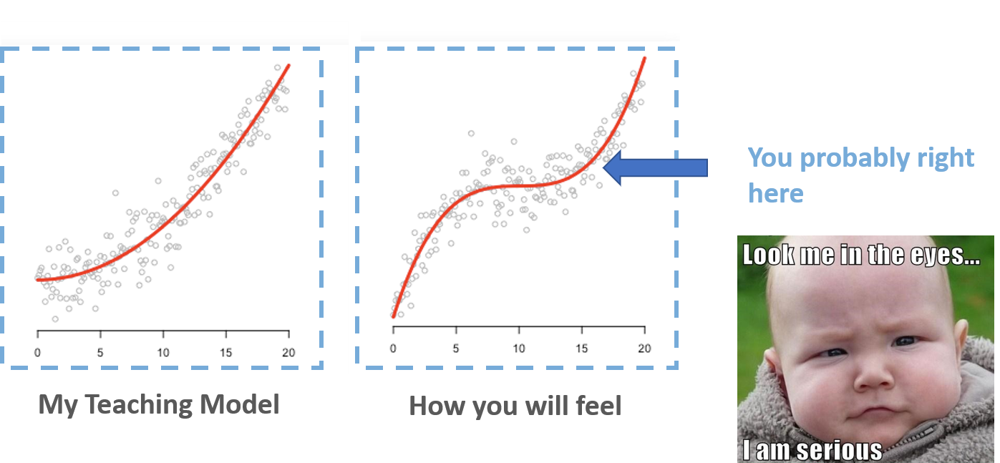
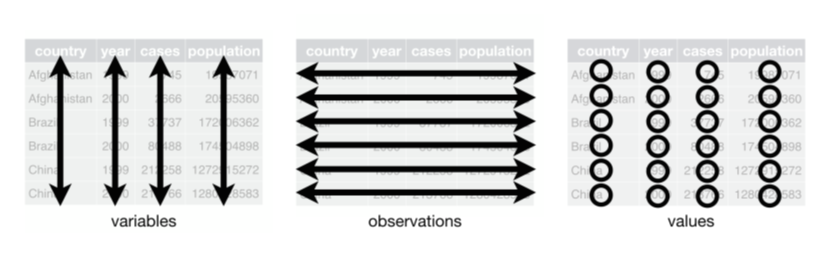
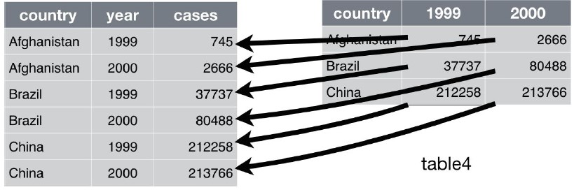
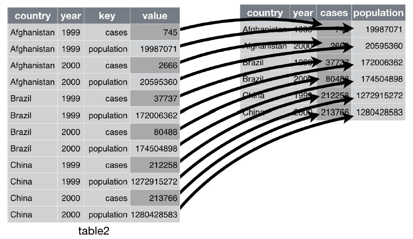
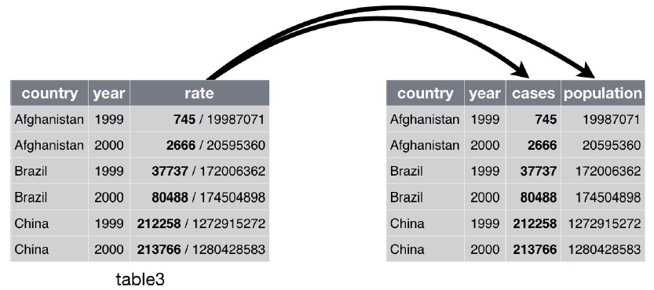
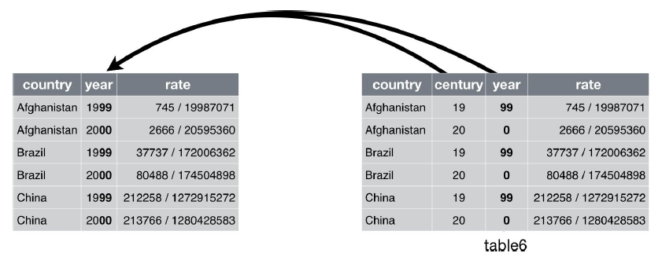

# Data wrangling with tibbles, readr and tidyr

## Where are we (probability 0.8)
<p align="center">
  
</p>


## Tibbles with tibble

### Tibble and Prerequisites

Tibbles are a modern take on data frames. They keep the features that have stood the test of time, and drop the features that used to be convenient but are now frustrating (i.e. converting character vectors to factors).

```r
library(tidyverse)
#or
library(tibble)
```

> ### Packages/Books Authors
> Dr. Hadley Wickham
> - Chief Scientist at RStudio,
> - Adjunct Professor of Statistics at University of Auckland, Stanford University, and Rice University
> - Books: **R for Data Science**, **Advanced R**, **R packages**
> - Packages: **tidyverse**, **devtools**, **pkgdown**
>
> Dr. Yihui Xie
> - SDE at RStudio
> - Packages: **knitr**, **rmarkdown**, **shiny**, **tinytex**, **bookdown**, **DT**

> ### Tips
> If you wanted to learn more about the packages from tidyverse, you may try
>
> ```r
>   vignette("tibble")
>   vignette("ggplot2-specs")
> ```
> Pronounce [vin'jet]

### Creating tibbles

`tibble()` is a nice way to create data frames. It encapsulates best practices for data frames:

```r
tibble(letter=c("a","b","c"), number=c(1:3))
```

```
## # A tibble: 3 × 2
##   letter number
##   <chr>   <int>
## 1 a           1
## 2 b           2
## 3 c           3
```

### Convert the data frame into tibble version of data frame

You can do that with `as_tibble()`:

```r
irisTibble <- as_tibble(iris)
class(irisTibble)
```

### Adjust the names of variables

`data.frame()` will adjust the name of variables, unless overwrite check.names=F

```r
data.frame(`a b`=c(1:3))
```

```
##   a.b
## 1   1
## 2   2
## 3   3
```

```r
data.frame(`a b`=c(1:3), check.names = F)
```

```
##   a b
## 1   1
## 2   2
## 3   3
```

### `tibble()` never adjusts the name of variables

```r
tibble(`a b`=c(1:3))
```

```
## # A tibble: 3 × 1
##   `a b`
##   <int>
## 1     1
## 2     2
## 3     3
```

### `tibble()` never adjusts the name of variables: Nonsyntactic names

It’s possible for a tibble to have column names that are not valid R variable names, aka nonsyntactic names.

```r
data.frame(
  `:(` = "unhappy",
  ` ` = "space",
  `2000` = "number"
)
```

```
##       X..    X.  X2000
## 1 unhappy space number
```

```r
tibble(
  `:(` = "unhappy",
  ` ` = "space",
  `2000` = "number"
)
```

```
## # A tibble: 1 × 3
##   `:(`    ` `   `2000`
##   <chr>   <chr> <chr>
## 1 unhappy space number
```

### Arguments

```r
tibble(x=1:3,
       y=x^2)
```

```
## # A tibble: 3 × 2
##       x     y
##   <int> <dbl>
## 1     1     1
## 2     2     4
## 3     3     9
```

### Creating with `tribble()`

Another way to create a tibble is with tribble(), short for transposed tibble. tribble() is customized for data entry in code: column headings are defined by formulas (i.e., they start with ~), and entries are separated by commas. This makes it possible to lay out small amounts of data in easy-to-read form:

```r
tribble(~x, ~y, ~z,
        "a", 1, 3.5,
        "b", 2, 3)
```

```
## # A tibble: 2 × 3
##   x         y     z
##   <chr> <dbl> <dbl>
## 1 a         1   3.5
## 2 b         2   3
```

## Data import with `readr`

readr and prerequisites

Here we will only introduce the most common function from the readr package `read_csv()`

```r
library(tidyverse)
#or
library(readr)
```

### Compared to the Base R function read.csv()

- They are typically much faster (~10x)
- They produce tibbles, and they don’t convert character vectors to factors, use row names, or munge the column names.
- They are more reproducible.

### Reading csv with `read_csv()`

```r
df1 <-
  read_csv(
    "https://gist.githubusercontent.com/omarish/5687264/raw/7e5c814ce6ef33e25d5259c1fe79463c190800d9/mpg.csv"
  )
df2 <- read_csv(readr_example("mtcars.csv"))
```

```r
df1 <-
  read_csv(
    "https://gist.githubusercontent.com/omarish/5687264/raw/7e5c814ce6ef33e25d5259c1fe79463c190800d9/mpg.csv"
  )
```

```
## Rows: 398 Columns: 9
## ── Column specification ────────────────────────────────────────────────────────
## Delimiter: ","
## chr (2): horsepower, name
## dbl (7): mpg, cylinders, displacement, weight, acceleration, model_year, origin
##
## ℹ Use `spec()` to retrieve the full column specification for this data.
## ℹ Specify the column types or set `show_col_types = FALSE` to quiet this message.
```

```r
df1
```

```
## # A tibble: 398 × 9
##      mpg cylinders displacement horsepower weight acceleration model_year origin
##    <dbl>     <dbl>        <dbl> <chr>       <dbl>        <dbl>      <dbl>  <dbl>
##  1    18         8          307 130          3504         12           70      1
##  2    15         8          350 165          3693         11.5         70      1
##  3    18         8          318 150          3436         11           70      1
##  4    16         8          304 150          3433         12           70      1
##  5    17         8          302 140          3449         10.5         70      1
##  6    15         8          429 198          4341         10           70      1
##  7    14         8          454 220          4354          9           70      1
##  8    14         8          440 215          4312          8.5         70      1
##  9    14         8          455 225          4425         10           70      1
## 10    15         8          390 190          3850          8.5         70      1
## # … with 388 more rows, and 1 more variable: name <chr>
```

```r
df2 <- read_csv(readr_example("mtcars.csv"))
```

```
## Rows: 32 Columns: 11
## ── Column specification ────────────────────────────────────────────────────────
## Delimiter: ","
## dbl (11): mpg, cyl, disp, hp, drat, wt, qsec, vs, am, gear, carb
##
## ℹ Use `spec()` to retrieve the full column specification for this data.
## ℹ Specify the column types or set `show_col_types = FALSE` to quiet this message.
```

```r
df2
```

```
## # A tibble: 32 × 11
##      mpg   cyl  disp    hp  drat    wt  qsec    vs    am  gear  carb
##    <dbl> <dbl> <dbl> <dbl> <dbl> <dbl> <dbl> <dbl> <dbl> <dbl> <dbl>
##  1  21       6  160    110  3.9   2.62  16.5     0     1     4     4
##  2  21       6  160    110  3.9   2.88  17.0     0     1     4     4
##  3  22.8     4  108     93  3.85  2.32  18.6     1     1     4     1
##  4  21.4     6  258    110  3.08  3.22  19.4     1     0     3     1
##  5  18.7     8  360    175  3.15  3.44  17.0     0     0     3     2
##  6  18.1     6  225    105  2.76  3.46  20.2     1     0     3     1
##  7  14.3     8  360    245  3.21  3.57  15.8     0     0     3     4
##  8  24.4     4  147.    62  3.69  3.19  20       1     0     4     2
##  9  22.8     4  141.    95  3.92  3.15  22.9     1     0     4     2
## 10  19.2     6  168.   123  3.92  3.44  18.3     1     0     4     4
## # … with 22 more rows
```

### Like `tribble()`, inline input is also accepted.

```r
read_csv("x, y, z
         1, 1, 1
         2, 2, 2")
```

```
## Rows: 2 Columns: 3
## ── Column specification ────────────────────────────────────────────────────────
## Delimiter: ","
## dbl (3): x, y, z
##
## ℹ Use `spec()` to retrieve the full column specification for this data.
## ℹ Specify the column types or set `show_col_types = FALSE` to quiet this message.
## # A tibble: 2 × 3
##       x     y     z
##   <dbl> <dbl> <dbl>
## 1     1     1     1
## 2     2     2     2
```

### Replace values with NA

```r
read_csv("x, y, z
         1, 1, 1
         2, 2, 2", na="1")
```

```
## Rows: 2 Columns: 3
## ── Column specification ────────────────────────────────────────────────────────
## Delimiter: ","
## dbl (3): x, y, z
##
## ℹ Use `spec()` to retrieve the full column specification for this data.
## ℹ Specify the column types or set `show_col_types = FALSE` to quiet this message.
## # A tibble: 2 × 3
##       x     y     z
##   <dbl> <dbl> <dbl>
## 1    NA    NA    NA
## 2     2     2     2
```


### Let's recall the example of h1b data in hw2
When we use the base function read.csv, the parse of data types may be wrong:

```r
h1b19 <-
  read.csv("E:/IE6600/materials/assignment/hw/hw2/h1b_datahubexport-2019.csv")
sapply(h1b19[, 3:6], class)
```

```
##    Initial.Approvals      Initial.Denials Continuing.Approvals
##          "character"          "character"          "character"
##   Continuing.Denials
##          "character"
```

### `guess_max`
The default guesses are only for the first 1000 rows. Sometimes, 1000 rows may not be enough for `read_csv()` to parse the column specification. We could use guess_max= to increase the guessing rows.

```r
chg <- read_csv(readr_example("challenge.csv"))
```

```
## Rows: 2000 Columns: 2
## ── Column specification ────────────────────────────────────────────────────────
## Delimiter: ","
## dbl  (1): x
## date (1): y
##
## ℹ Use `spec()` to retrieve the full column specification for this data.
## ℹ Specify the column types or set `show_col_types = FALSE` to quiet this message.
```

```r
adj.chg<- read_csv(readr_example("challenge.csv"), guess_max = 1500)
```


Compared to default read.csv

```r
adj.chg2<- read.csv(readr_example("challenge.csv"))
class(adj.chg2$y[1])
```

```
## [1] "character"
```

```r
class(adj.chg$y[1])
```

```
## [1] "Date"
```

### Two cases 1/2
Sometimes there are a few lines of metadata at the top of the file. You can use `skip = n` to skip the first n lines; or use `comment = "#"` to drop all lines that start with (e.g.) #:

```r
read_csv("# A comment I want to skip
  x,y,z
  1,2,3", comment = "#")
```

```
## Rows: 1 Columns: 3
## ── Column specification ────────────────────────────────────────────────────────
## Delimiter: ","
## dbl (3): x, y, z
##
## ℹ Use `spec()` to retrieve the full column specification for this data.
## ℹ Specify the column types or set `show_col_types = FALSE` to quiet this message.
## # A tibble: 1 × 3
##       x     y     z
##   <dbl> <dbl> <dbl>
## 1     1     2     3
```

### Two cases 2/2
The data might not have column names. You can use `col_names = FALSE` to tell `read_csv()` not to treat the first row as headings, and instead label them sequentially from X1 to Xn:

```r
read_csv("1,2,3\n4,5,6", col_names = FALSE)
```

```
## Rows: 2 Columns: 3
## ── Column specification ────────────────────────────────────────────────────────
## Delimiter: ","
## dbl (3): X1, X2, X3
##
## ℹ Use `spec()` to retrieve the full column specification for this data.
## ℹ Specify the column types or set `show_col_types = FALSE` to quiet this message.
## # A tibble: 2 × 3
##      X1    X2    X3
##   <dbl> <dbl> <dbl>
## 1     1     2     3
## 2     4     5     6
```

```r
read_csv("1,2,3\n4,5,6",col_names = c("x", "y", "z"))
```

### Writing csv with `write_csv()`

The default syntax:

```r
  write_csv(yourDataName, "yourLocation/yourCSVname.csv")
```


## Tidy data with tidyr

Prerequisites

In this chapter we’ll focus on **tidyr**, a package that provides a bunch of tools to help tidy up your messy datasets. **tidyr** is a member of the core tidyverse.

```r
library(tidyr)
#or
library(tidyverse)
```

Five data tables we will use from the packages tidyverse:

**table1**, **table2**, **table3**, **table4a**, **table4b**


### What is tidy data?
There are three interrelated rules which make a dataset tidy:

- Each variable must have its own column.
- Each observation must have its own row.
- Each value must have its own cell.

<p align="center">
  
</p>


### What do you think of this data? Tidy?

```
## # A tibble: 12 × 4
##    country      year type            count
##    <chr>       <int> <chr>           <int>
##  1 Afghanistan  1999 cases             745
##  2 Afghanistan  1999 population   19987071
##  3 Afghanistan  2000 cases            2666
##  4 Afghanistan  2000 population   20595360
##  5 Brazil       1999 cases           37737
##  6 Brazil       1999 population  172006362
##  7 Brazil       2000 cases           80488
##  8 Brazil       2000 population  174504898
##  9 China        1999 cases          212258
## 10 China        1999 population 1272915272
## 11 China        2000 cases          213766
## 12 China        2000 population 1280428583
```

```
## # A tibble: 6 × 3
##   country      year rate
## * <chr>       <int> <chr>
## 1 Afghanistan  1999 745/19987071
## 2 Afghanistan  2000 2666/20595360
## 3 Brazil       1999 37737/172006362
## 4 Brazil       2000 80488/174504898
## 5 China        1999 212258/1272915272
## 6 China        2000 213766/1280428583
```

```
## # A tibble: 3 × 3
##   country     `1999` `2000`
## * <chr>        <int>  <int>
## 1 Afghanistan    745   2666
## 2 Brazil       37737  80488
## 3 China       212258 213766
```

```
## # A tibble: 3 × 3
##   country         `1999`     `2000`
## * <chr>            <int>      <int>
## 1 Afghanistan   19987071   20595360
## 2 Brazil       172006362  174504898
## 3 China       1272915272 1280428583
```

```
## # A tibble: 6 × 4
##   country      year  cases population
##   <chr>       <int>  <int>      <int>
## 1 Afghanistan  1999    745   19987071
## 2 Afghanistan  2000   2666   20595360
## 3 Brazil       1999  37737  172006362
## 4 Brazil       2000  80488  174504898
## 5 China        1999 212258 1272915272
## 6 China        2000 213766 1280428583
```

```
## # A tibble: 6 × 4
##   country     century year  rate
## * <chr>       <chr>   <chr> <chr>
## 1 Afghanistan 19      99    745/19987071
## 2 Afghanistan 20      00    2666/20595360
## 3 Brazil      19      99    37737/172006362
## 4 Brazil      20      00    80488/174504898
## 5 China       19      99    212258/1272915272
## 6 China       20      00    213766/1280428583
```

### Why ensure that your data is tidy?

- Picking one consistent way of storing data.
- Placing variables in columns is intuitively and computationally efficient


### Spreading and Gathering
The tidyr packages is one part of the tidyverse To resolve one of the two common problems when dealing with datasets:

- One variable might be spread across multiple columns.
- One observation might be scattered across multiple rows.
-
We need to use `gather()` and `spread()` from tidyr


### Gathering
A common problem is a dataset where some of the column names are not names of variables, but values of a variable

```
table4a
## # A tibble: 3 × 3
##   country     `1999` `2000`
## * <chr>        <int>  <int>
## 1 Afghanistan    745   2666
## 2 Brazil       37737  80488
## 3 China       212258 213766
```

```r
table4a %>%
  gather("1999", "2000", key="year", value="cases")
```

```
## # A tibble: 6 × 3
##   country     year   cases
##   <chr>       <chr>  <int>
## 1 Afghanistan 1999     745
## 2 Brazil      1999   37737
## 3 China       1999  212258
## 4 Afghanistan 2000    2666
## 5 Brazil      2000   80488
## 6 China       2000  213766
```


<p align="center">
  
</p>

> ### Exercise
> use `gather()` to make table4b tidy
>
> ```r
> table4b
> ```
>
> ```
> ## # A tibble: 3 × 3
> ##   country         `1999`     `2000`
> ## * <chr>            <int>      <int>
> ## 1 Afghanistan   19987071   20595360
> ## 2 Brazil       172006362  174504898
> ## 3 China       1272915272 1280428583
> ```
>
> **Solution**:
> ```r
> table4b %>% gather("1999", "2000", key="year", value="population")
> ```


### Spreading
Spreading is the opposite of gathering. You use it when an observation is scattered across multiple rows.

```r
table2
```

```
## # A tibble: 12 × 4
##    country      year type            count
##    <chr>       <int> <chr>           <int>
##  1 Afghanistan  1999 cases             745
##  2 Afghanistan  1999 population   19987071
##  3 Afghanistan  2000 cases            2666
##  4 Afghanistan  2000 population   20595360
##  5 Brazil       1999 cases           37737
##  6 Brazil       1999 population  172006362
##  7 Brazil       2000 cases           80488
##  8 Brazil       2000 population  174504898
##  9 China        1999 cases          212258
## 10 China        1999 population 1272915272
## 11 China        2000 cases          213766
## 12 China        2000 population 1280428583
```

```r
table2 %>%
  spread(key=type, value=count)
```

```
## # A tibble: 6 × 4
##   country      year  cases population
##   <chr>       <int>  <int>      <int>
## 1 Afghanistan  1999    745   19987071
## 2 Afghanistan  2000   2666   20595360
## 3 Brazil       1999  37737  172006362
## 4 Brazil       2000  80488  174504898
## 5 China        1999 212258 1272915272
## 6 China        2000 213766 1280428583
```

<p align="center">
  
</p>


> ## Exercise I
>
> Use `tribble()` or `tibble()` create a data table as follows:
>
> ```
> ## # A tibble: 2 × 3
> ##   pregnant  male female
> ##   <chr>    <dbl>  <dbl>
> ## 1 yes         NA     10
> ## 2 no          20     12
> ```
>
> Then make it tidy.
>
> **Solution**:
> ```r
> tribble(~pregnant, ~male, ~female,
>         "yes", NA, 10,
>         "no", 20, 12
> ) %>%
>   gather(male, female, key="gender", value="pop")
> ```

> ## Exercise II
> Use tribble() or tibble() create a data table as follows:
> ```
> ## # A tibble: 6 × 3
> ##   person index      number
> ##   <chr>  <chr>       <dbl>
> ## 1 A      weight(kg)   52.5
> ## 3 C      weight(kg)   54.6
> ## 4 A      height(cm)  179.
> ## 5 B      height(cm)  171.
> ## 6 C      height(cm)  173.
> ```
> Then make it tidy.
>
> **Solution**:
> ```r
> tibble(person=rep(c("A","B","C"),2),
>        index=c(rep("weight(kg)",3),rep("height(cm)",3)),
>        number=rd) %>%
>   spread(key=index, value=number)
> ```


### Separating and Pull

So far you’ve learned how to tidy table2 and table4, but not table3. table3 has a different problem: we have one column (rate) that contains two variables (cases and population). To fix this problem, we’ll need the `separate()` function.

### Separate
`separate()` pulls apart one column into multiple columns, by splitting wherever a separator character appears.

```r
table3
```

```
## # A tibble: 6 × 3
##   country      year rate
## * <chr>       <int> <chr>
## 1 Afghanistan  1999 745/19987071
## 2 Afghanistan  2000 2666/20595360
## 3 Brazil       1999 37737/172006362
## 4 Brazil       2000 80488/174504898
## 5 China        1999 212258/1272915272
## 6 China        2000 213766/1280428583
```

```r
table3 %>%
  separate(rate, into=c("cases","population"))
```

```
## # A tibble: 6 × 4
##   country      year cases  population
##   <chr>       <int> <chr>  <chr>
## 1 Afghanistan  1999 745    19987071
## 2 Afghanistan  2000 2666   20595360
## 3 Brazil       1999 37737  172006362
## 4 Brazil       2000 80488  174504898
## 5 China        1999 212258 1272915272
## 6 China        2000 213766 1280428583
```

<p align="center">
  
</p>


By default, separate() will split values wherever it sees a nonalphanumeric character (i.e., a character that isn’t a number or letter).

```r
table3 %>%
  separate(rate, into=c("cases","population"), sep="/")
```

```
## # A tibble: 6 × 4
##   country      year cases  population
##   <chr>       <int> <chr>  <chr>
## 1 Afghanistan  1999 745    19987071
## 2 Afghanistan  2000 2666   20595360
## 3 Brazil       1999 37737  172006362
## 4 Brazil       2000 80488  174504898
## 5 China        1999 212258 1272915272
## 6 China        2000 213766 1280428583
```

### Did you find the problem/s?

```
## # A tibble: 6 × 4
##   country      year cases  population
##   <chr>       <int> <chr>  <chr>
## 1 Afghanistan  1999 745    19987071
## 2 Afghanistan  2000 2666   20595360
## 3 Brazil       1999 37737  172006362
## 4 Brazil       2000 80488  174504898
## 5 China        1999 212258 1272915272
## 6 China        2000 213766 1280428583
```

### Convert the separated columns into correct data type
We can ask `separate() `to try and convert to better types using convert = TRUE:

```r
table3 %>%
  separate(
    rate,
    into = c("cases", "population"),
    convert = TRUE
)
```

```
## # A tibble: 6 × 4
##   country      year  cases population
##   <chr>       <int>  <int>      <int>
## 1 Afghanistan  1999    745   19987071
## 2 Afghanistan  2000   2666   20595360
## 3 Brazil       1999  37737  172006362
## 4 Brazil       2000  80488  174504898
## 5 China        1999 212258 1272915272
## 6 China        2000 213766 1280428583
```

### Unite
`unite()` is the inverse of `separate()`: it combines multiple columns into a single column.

```r
table5
```

```
## # A tibble: 6 × 4
##   country     century year  rate
## * <chr>       <chr>   <chr> <chr>
## 1 Afghanistan 19      99    745/19987071
## 2 Afghanistan 20      00    2666/20595360
## 3 Brazil      19      99    37737/172006362
## 4 Brazil      20      00    80488/174504898
## 5 China       19      99    212258/1272915272
## 6 China       20      00    213766/1280428583
```

```r
table5 %>%
  unite(new, century, year)
```

```
## # A tibble: 6 × 3
##   country     new   rate
##   <chr>       <chr> <chr>
## 1 Afghanistan 19_99 745/19987071
## 2 Afghanistan 20_00 2666/20595360
## 3 Brazil      19_99 37737/172006362
## 4 Brazil      20_00 80488/174504898
## 5 China       19_99 212258/1272915272
## 6 China       20_00 213766/1280428583
```

<p align="center">
  
</p>


The default will place an underscore (_) between the values from different columns. Here we don’t want any separator so we use "":

```r
table5 %>%
  unite(new, century, year, sep="")
```

```
## # A tibble: 6 × 3
##   country     new   rate
##   <chr>       <chr> <chr>
## 1 Afghanistan 1999  745/19987071
## 2 Afghanistan 2000  2666/20595360
## 3 Brazil      1999  37737/172006362
## 4 Brazil      2000  80488/174504898
## 5 China       1999  212258/1272915272
## 6 China       2000  213766/1280428583
```


> ## Exercise
>
> - Selecting year, month, flight, and tailnum columns from nycflights13::flights dataset.
> - Combining year, and month with separator / in a new column, date.
> - Then count the number of oberservations for each date, and sort by desc
> 
> **Solution**:
> ```r
> # use count() or group_by() with summarise() to
> # count the number of oberservations for each `date`
> flights %>%
>   select(year, month, flight, tailnum) %>%
>   unite(date, year, month, sep="/") %>%
>   count(date, sort=T)
> ```


#### References
[1] [Hadley Wickham, Garrett Grolemund. R For Data Science.](https://r4ds.had.co.nz/)
