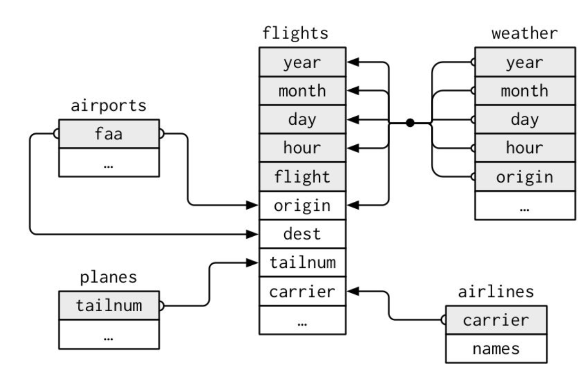

# Visualizing Relational Data


## introduction

It’s rare that a data analysis involves only a single table of data. Typically you have many tables of data, and you must combine them to answer the questions that you’re interested in. Collectively, multiple tables of data are called relational data because it is the relations, not just the individual datasets, that are important.

To work with relational data you need verbs that work with pairs of tables. There are two most common families of verbs designed to work with relational data:


- Mutating joins, which add new variables to one data frame from matching observations in another.

- Filtering joins, which filter observations from one data frame based on whether or not they match an observation in the other table.

## Prerequisites

```r
library(tidyverse)
library(nycflights13)
```

## nycflights13

**airlines** lets you look up the full carrier name from its abbreviated code:

```r
head(airlines)
```

```
## # A tibble: 6 × 2
##   carrier name
##   <chr>   <chr>
## 1 9E      Endeavor Air Inc.
## 2 AA      American Airlines Inc.
## 3 AS      Alaska Airlines Inc.
## 4 B6      JetBlue Airways
## 5 DL      Delta Air Lines Inc.
## 6 EV      ExpressJet Airlines Inc.
```

**airports** gives information about each airport, identified by the faa airport code:

```r
airports
```

```
## # A tibble: 1,458 × 8
##    faa   name                             lat    lon   alt    tz dst   tzone
##    <chr> <chr>                          <dbl>  <dbl> <dbl> <dbl> <chr> <chr>
##  1 04G   Lansdowne Airport               41.1  -80.6  1044    -5 A     America/…
##  2 06A   Moton Field Municipal Airport   32.5  -85.7   264    -6 A     America/…
##  3 06C   Schaumburg Regional             42.0  -88.1   801    -6 A     America/…
##  4 06N   Randall Airport                 41.4  -74.4   523    -5 A     America/…
##  5 09J   Jekyll Island Airport           31.1  -81.4    11    -5 A     America/…
##  6 0A9   Elizabethton Municipal Airport  36.4  -82.2  1593    -5 A     America/…
##  7 0G6   Williams County Airport         41.5  -84.5   730    -5 A     America/…
##  8 0G7   Finger Lakes Regional Airport   42.9  -76.8   492    -5 A     America/…
##  9 0P2   Shoestring Aviation Airfield    39.8  -76.6  1000    -5 U     America/…
## 10 0S9   Jefferson County Intl           48.1 -123.    108    -8 A     America/…
## # … with 1,448 more rows
```


**planes** gives information about each plane, identified by its tailnum:

```r
planes
```

```
## # A tibble: 3,322 × 9
##    tailnum  year type              manufacturer model engines seats speed engine
##    <chr>   <int> <chr>             <chr>        <chr>   <int> <int> <int> <chr>
##  1 N10156   2004 Fixed wing multi… EMBRAER      EMB-…       2    55    NA Turbo…
##  2 N102UW   1998 Fixed wing multi… AIRBUS INDU… A320…       2   182    NA Turbo…
##  3 N103US   1999 Fixed wing multi… AIRBUS INDU… A320…       2   182    NA Turbo…
##  4 N104UW   1999 Fixed wing multi… AIRBUS INDU… A320…       2   182    NA Turbo…
##  5 N10575   2002 Fixed wing multi… EMBRAER      EMB-…       2    55    NA Turbo…
##  6 N105UW   1999 Fixed wing multi… AIRBUS INDU… A320…       2   182    NA Turbo…
##  7 N107US   1999 Fixed wing multi… AIRBUS INDU… A320…       2   182    NA Turbo…
##  8 N108UW   1999 Fixed wing multi… AIRBUS INDU… A320…       2   182    NA Turbo…
##  9 N109UW   1999 Fixed wing multi… AIRBUS INDU… A320…       2   182    NA Turbo…
## 10 N110UW   1999 Fixed wing multi… AIRBUS INDU… A320…       2   182    NA Turbo…
## # … with 3,312 more rows
```

**weather** gives the weather at each NYC airport for each hour:

```r
weather
```

```
## # A tibble: 26,115 × 15
##    origin  year month   day  hour  temp  dewp humid wind_dir wind_speed
##    <chr>  <int> <int> <int> <int> <dbl> <dbl> <dbl>    <dbl>      <dbl>
##  1 EWR     2013     1     1     1  39.0  26.1  59.4      270      10.4
##  2 EWR     2013     1     1     2  39.0  27.0  61.6      250       8.06
##  3 EWR     2013     1     1     3  39.0  28.0  64.4      240      11.5
##  4 EWR     2013     1     1     4  39.9  28.0  62.2      250      12.7
##  5 EWR     2013     1     1     5  39.0  28.0  64.4      260      12.7
##  6 EWR     2013     1     1     6  37.9  28.0  67.2      240      11.5
##  7 EWR     2013     1     1     7  39.0  28.0  64.4      240      15.0
##  8 EWR     2013     1     1     8  39.9  28.0  62.2      250      10.4
##  9 EWR     2013     1     1     9  39.9  28.0  62.2      260      15.0
## 10 EWR     2013     1     1    10  41    28.0  59.6      260      13.8
## # … with 26,105 more rows, and 5 more variables: wind_gust <dbl>, precip <dbl>,
## #   pressure <dbl>, visib <dbl>, time_hour <dttm>
```

## nycflights13 Entity Relationship Diagram

One way to show the relationships between the different tables is with a drawing: **If you have taken database management, you would be familiar with.**


<p align="center">
  
</p>
Hadley Wickham, Garrett Grolemund. R For Data Science.


For **nycflights13**:

- flights connects to planes via a single variable, tailnum.

- flights connects to airlines through the carrier variable.

- flights connects to airports in two ways: via the origin and dest variables.

- flights connects to weather via origin (the location), and year, month, day, and hour (the time).


## Key for relational data table
There are two types of keys:

- A primary key uniquely identifies an observation in its own table.

- A foreign key uniquely identifies an observation in another table.


### Primary key (PK)
For example, planes$tailnum is a primary key because it uniquely identifies each plane in the planes table.

```
planes
```

```
## # A tibble: 3,322 × 9
##    tailnum  year type              manufacturer model engines seats speed engine
##    <chr>   <int> <chr>             <chr>        <chr>   <int> <int> <int> <chr>
##  1 N10156   2004 Fixed wing multi… EMBRAER      EMB-…       2    55    NA Turbo…
##  2 N102UW   1998 Fixed wing multi… AIRBUS INDU… A320…       2   182    NA Turbo…
##  3 N103US   1999 Fixed wing multi… AIRBUS INDU… A320…       2   182    NA Turbo…
##  4 N104UW   1999 Fixed wing multi… AIRBUS INDU… A320…       2   182    NA Turbo…
##  5 N10575   2002 Fixed wing multi… EMBRAER      EMB-…       2    55    NA Turbo…
##  6 N105UW   1999 Fixed wing multi… AIRBUS INDU… A320…       2   182    NA Turbo…
##  7 N107US   1999 Fixed wing multi… AIRBUS INDU… A320…       2   182    NA Turbo…
##  8 N108UW   1999 Fixed wing multi… AIRBUS INDU… A320…       2   182    NA Turbo…
##  9 N109UW   1999 Fixed wing multi… AIRBUS INDU… A320…       2   182    NA Turbo…
## 10 N110UW   1999 Fixed wing multi… AIRBUS INDU… A320…       2   182    NA Turbo…
## # … with 3,312 more rows
```

If we would likt to find one plane with tailnumber "**N110UW**"

```r
planes %>%
  filter(tailnum=="N110UW")
```

```
## # A tibble: 1 × 9
##   tailnum  year type               manufacturer model engines seats speed engine
##   <chr>   <int> <chr>              <chr>        <chr>   <int> <int> <int> <chr>
## 1 N110UW   1999 Fixed wing multi … AIRBUS INDU… A320…       2   182    NA Turbo…
```

Of course, the PK can be a combination of variables:`c(year, month, day, hour, minute, origin)`

```r
flights %>%
  filter(year==2013, month==1, day==5, hour==5, minute==40, origin=="JFK")
```

```
## # A tibble: 1 × 19
##    year month   day dep_time sched_dep_time dep_delay arr_time sched_arr_time
##   <int> <int> <int>    <int>          <int>     <dbl>    <int>          <int>
## 1  2013     1     5      537            540        -3      831            850
## # … with 11 more variables: arr_delay <dbl>, carrier <chr>, flight <int>,
## #   tailnum <chr>, origin <chr>, dest <chr>, air_time <dbl>, distance <dbl>,
## #   hour <dbl>, minute <dbl>, time_hour <dttm>
```


### Foreign key

For example, flights$tailnum is a foreign key because it appears in the flights table where it matches each flight to a unique plane in the plane talbe. Which means in the table flights, the tailnum is a foreign key not a PK; but in the table plane, the tailnum is a PK

```r
flights %>%
  filter(tailnum=="N110UW")
```

```
## # A tibble: 40 × 19
##     year month   day dep_time sched_dep_time dep_delay arr_time sched_arr_time
##    <int> <int> <int>    <int>          <int>     <dbl>    <int>          <int>
##  1  2013     1    10      620            630       -10      855            831
##  2  2013    10     6      959            959         0     1214           1207
##  3  2013    10     9     1639           1540        59     1830           1742
##  4  2013    10    24     1600           1550        10     1756           1752
##  5  2013    11     6     1546           1544         2     1741           1750
##  6  2013    11     9     1458           1500        -2     1649           1656
##  7  2013    11    10      818            825        -7     1007           1029
##  8  2013    11    13     1540           1544        -4     1738           1750
##  9  2013    11    21     1222           1200        22     1413           1359
## 10  2013    11    26     1603           1544        19     1842           1750
...
```


## Mutate Join

#### Data table

<p align="center">
  
</p>

```r
x <- tribble(
  ~key, ~val_x,
  1, "x1",
  2, "x2",
  3, "x3"
)
y <- tribble(
  ~key, ~val_y,
  1, "y1",
  2, "y2",
  4, "y3"
)
```

### Inner join


<p align="center">
  
</p>

Base R functoin:

```r
merge(x, y, by="key")

#or
x %>%
  merge(y, by="key")
```

dplyr `inner_join()` function:

```r
inner_join(x, y, by="key")
```

```
## # A tibble: 2 × 3
##     key val_x val_y
##   <dbl> <chr> <chr>
## 1     1 x1    y1
## 2     2 x2    y2
```

```r
#or
x %>%
  inner_join(y, by="key")
```

```
## # A tibble: 2 × 3
##     key val_x val_y
##   <dbl> <chr> <chr>
## 1     1 x1    y1
## 2     2 x2    y2
```

#### If the keys are different

#### Data

```r
x <- tribble(
  ~key, ~val_x,
  1, "x1",
  2, "x2",
  3, "x3"
)
y1 <- tribble(
  ~key1, ~val_y,
  1, "y1",
  2, "y2",
  4, "y3"
)
```


Base function:

```r
merge(x, y1, by.x="key", by.y="key1")
```

dplyr function:

```r
inner_join(x, y1, by=c("key"="key1"))
```


### Left join

<p align="center">
  
</p>


Base R functoin:

```r
merge(x, y, by="key", all.x=TRUE)
#or
x %>%
  merge(y, by="key", all.x=TRUE)
```

dplyr `left_join()` function:

```r
left_join(x, y, by="key")
```

```
## # A tibble: 3 × 3
##     key val_x val_y
##   <dbl> <chr> <chr>
## 1     1 x1    y1
## 2     2 x2    y2
## 3     3 x3    <NA>
```

```r
#or
x %>%
  left_join(y, by="key")
```

```
## # A tibble: 3 × 3
##     key val_x val_y
##   <dbl> <chr> <chr>
## 1     1 x1    y1
## 2     2 x2    y2
## 3     3 x3    <NA>
```


### Right join

<p align="center">
  
</p>

Base R functoin:

```r
merge(x, y, by="key", all.y=TRUE)
#or
x %>%
  merge(y, by="key", all.y=TRUE)
```

dplyr `right_join()` function:

```r
right_join(x, y, by="key")
```

```
## # A tibble: 3 × 3
##     key val_x val_y
##   <dbl> <chr> <chr>
## 1     1 x1    y1
## 2     2 x2    y2
## 3     4 <NA>  y3
```

```r
#or
x %>%
  right_join(y, by="key")
```

```
## # A tibble: 3 × 3
##     key val_x val_y
##   <dbl> <chr> <chr>
## 1     1 x1    y1
## 2     2 x2    y2
## 3     4 <NA>  y3
```


### Full join

<p align="center">
  
</p>

Base R functoin:

```r
merge(x, y, by="key",
      all.x=TRUE,
      all.y = TRUE)
#or
x %>%
  merge(y, by="key",
        all.x=TRUE,
        all.y = TRUE)
```


dplyr `full_join()` function:

```r
full_join(x, y, by="key")
```

```
## # A tibble: 4 × 3
##     key val_x val_y
##   <dbl> <chr> <chr>
## 1     1 x1    y1
## 2     2 x2    y2
## 3     3 x3    <NA>
## 4     4 <NA>  y3
```

```r
#or
x %>%
  full_join(y, by="key")
```

```
## # A tibble: 4 × 3
##     key val_x val_y
##   <dbl> <chr> <chr>
## 1     1 x1    y1
## 2     2 x2    y2
## 3     3 x3    <NA>
## 4     4 <NA>  y3
```


## Filtering Joins

- semi_join(x, y) keeps all observations in x that have a match in y.
- anti_join(x, y) drops all observations in x that have a match in y.


### Semi-join

<p align="center">
  
</p>

`semi_join(x, y)` keeps all observations in x that have a match in y.


### Anti-join


<p align="center">
  
</p>

`anti_join(x, y)` drops all observations in x that have a match in y.


#### References
[1] [Hadley Wickham, Garrett Grolemund. R For Data Science.](https://r4ds.had.co.nz/)
